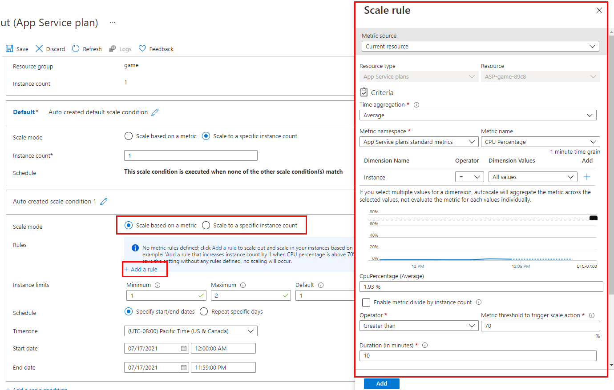

# Table of contents
[What is autoscaling?](#What-is-autoscaling)\
[Autoscaling rules](#Autoscaling-rules)\
[When should you consider autoscaling?](#When-should-you-consider-autoscaling)\
[Autoscale conditions](#Autoscale-conditions)\
[How an autoscale rule analyzes metrics](#How-an-autoscale-rule-analyzes-metrics)\
[Pairing autoscale rules](#Pairing-autoscale-rules)\
[Enable autoscaling](#Enable-autoscaling)
# What is autoscaling?
Autoscaling is a cloud system or process that adjusts available resources based on the current demand. Autoscaling performs scaling *in* and *out*, as opposed to scaling *up* and *down*.

# Autoscaling rules
Autoscaling makes its decisions based on rules that you define. A rule specifies the threshold for a metric, and triggers an autoscale event when this threshold is crossed. Autoscaling can also de-allocate resources when the workload has diminished.
# When should you consider autoscaling?
Autoscaling improves availability and fault tolerance. It can help ensure that client requests to a service won't be denied because an instance is either not able to acknowledge the request in a timely manner, or because an overloaded instance has crashed.

Autoscaling works by adding or removing web servers. If your web apps perform resource-intensive processing as part of each request, then autoscaling might not be an effective approach. In these situations, manually scaling up may be necessary.

Autoscaling isn't the best approach to handling long-term growth. You might have a web app that starts with a small number of users, but increases in popularity over time. Autoscaling has an overhead associated with monitoring resources and determining whether to trigger a scaling event. In this scenario, if you can anticipate the rate of growth, manually scaling the system over time may be a more cost effective approach.

# Autoscale conditions
- Scale based on a metric, such as the length of the disk queue, or the number of HTTP requests awaiting processing.
- Scale to a specific instance count according to a schedule. For example, you can arrange to scale out at a particular time of day, or on a specific date or day of the week. You also specify an end date, and the system will scale back in at this time.

# How an autoscale rule analyzes metrics
First an autoscale rule aggregates the values retrieved for a metric for all instances across a period of time (most cases this period is 1 minute). An interval of one minute is a very short interval in which to determine whether any change in metric is long-lasting enough to make autoscaling worthwhile. So, an autoscale rule performs a second stp that performs a further aggregation of the value calculated by the time aggregation over a longer, user-specified period, known as the *Duration*. The minimum *Duration* is 5 minutes.
# Pairing autoscale rules
You should plan for scaling-in when a workload decreases. Consider defining autoscale rules in pairs in the same autoscale condition.
# Enable autoscaling
Not all pricing tiers support autoscaling. The development pricing tiers are either limited to a single instance (the F1 and D1 tiers), or they only provide manual scaling (the B1 tier). If you've selected one of these tiers, you must first scale up to the S1 or any of the P level production tiers.

To get started with autoscaling navigate to to your App Service plan in the Azure portal and select Scale out (App Service plan) in the Settings group in the left navigation pane.

Navigate to your App Service plan in the Azure portal and select **Scale out (App Service plan)** in the **Settings** group in the left navigation pane.

Add autoscale rules

When having multiple rules: On *scale-out* autoscale runs if ANY rule is met. On *scale-in*, autoscale require ALL rules to be met.
