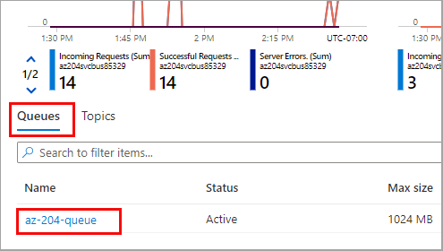

- [Exercise: Send and receive message from a Service Bus queue by using .NET.](#exercise-send-and-receive-message-from-a-service-bus-queue-by-using-net)
  - [Create Azure Resources](#create-azure-resources)
    - [Retrieve the connection string from the Service Bus Namespace](#retrieve-the-connection-string-from-the-service-bus-namespace)
  - [Create console app to send messages to the queue](#create-console-app-to-send-messages-to-the-queue)
  - [Update project to receive messages to the queue](#update-project-to-receive-messages-to-the-queue)
  - [Clean up resources](#clean-up-resources)
# Exercise: Send and receive message from a Service Bus queue by using .NET.

 Perform the following steps in the Azure portal *Bash Cloud Shell*

Create variables
```
myLocation=uksouth
myNameSpaceName=az204svcbus$RANDOM
myRg=az204-svcbus-rg
```

## Create Azure Resources
1. Create resource group to hold all other resources we'll be creating
```
az group create --name $myRg --location $myLocation
```
2. Create a Service Bus messaging namespace. The command below will create a namespace using the variable you created earlier.

```
az servicebus namespace create \
    --resource-group $myRg \
    --name $myNameSpaceName \
    --location $myLocation
```
3. Create a Service Bus queue
```
az servicebus queue create --resource-group $myRg \
    --namespace-name $myNameSpaceName \
    --name az204-queue
```
### Retrieve the connection string from the Service Bus Namespace
This can be found in the **az204svcbus** resource we just created under the **Shared access policies/RootManageSharedAccessKey** policy blade. Copy the `Primary Connection String`.

## Create console app to send messages to the queue
1. In terminal run the following commands
```
dotnet new console
dotnet add package Azure.Messaging.ServiceBus
```

2. In Program.cs add the following using statements
```
using System.Threading.Tasks;    
using Azure.Messaging.ServiceBus;
```

3. Add the following to static properties, with setting the `erviceBusConnectionString` to the connection string you copied earlier.

```
// connection string to your Service Bus namespace
static string connectionString = "<NAMESPACE CONNECTION STRING>";

// name of your Service Bus topic
static string queueName = "az204-queue";
```

4. Declare the following static properties in the `Program` class.
```
// the client that owns the connection and can be used to create senders and receivers
static ServiceBusClient client;

// the sender used to publish messages to the queue
static ServiceBusSender sender;

// number of messages to be sent to the queue
private const int numOfMessages = 3;
```

5. Replace the main method with the following
```
static async Task Main()
    {
        // Create the clients that we'll use for sending and processing messages.
        client = new ServiceBusClient(connectionString);
        sender = client.CreateSender(queueName);

        // create a batch 
        using ServiceBusMessageBatch messageBatch = await sender.CreateMessageBatchAsync();

        for (int i = 1; i <= 3; i++)
        {
            // try adding a message to the batch
            if (!messageBatch.TryAddMessage(new ServiceBusMessage($"Message {i}")))
            {
                // if it is too large for the batch
                throw new Exception($"The message {i} is too large to fit in the batch.");
            }
        }

        try 
        {
            // Use the producer client to send the batch of messages to the Service Bus queue
            await sender.SendMessagesAsync(messageBatch);
            Console.WriteLine($"A batch of {numOfMessages} messages has been published to the queue.");
        }
        finally
        {
            // Calling DisposeAsync on client types is required to ensure that network
            // resources and other unmanaged objects are properly cleaned up.
            await sender.DisposeAsync();
            await client.DisposeAsync();
        }

        Console.WriteLine("Press any key to end the application");
        Console.ReadKey();
    }
```

6. Save and build with `dotnet build` then run with `dotnet run`.:  You should see the following result: 
> A batch of 3 messages has been published to the queue.

7. Login to the Azure portal and navigate to your Service Bus namespace. On the Overview page, select the az204-queue queue in the bottom-middle pane.


Notice the following values in the Essentials section:

- The Active message count value for the queue is now 3. Each time you run this sender app without retrieving the messages, this value increases by 3.
- The current size of the queue increments each time the app adds messages to the queue.
- In the Messages chart in the bottom Metrics section, you can see that there are three incoming messages for the queue.

## Update project to receive messages to the queue
1. Move the contents of `Main` into a new private method called `SendMessages()`
2. Add a new static property

```
// the processor that reads and processes messages from the queue
static ServiceBusProcessor processor;
```
3. Add the following methods to the `Program` to handle messages and errors

```
// handle received messages
static async Task MessageHandler(ProcessMessageEventArgs args)
{
    string body = args.Message.Body.ToString();
    Console.WriteLine($"Received: {body}");

    // complete the message. messages is deleted from the queue. 
    await args.CompleteMessageAsync(args.Message);
}

// handle any errors when receiving messages
static Task ErrorHandler(ProcessErrorEventArgs args)
{
    Console.WriteLine(args.Exception.ToString());
    return Task.CompletedTask;
}
```

4. Create a new static async method called `ReadMessages` and call it from main

```
private static async Task ReadMessages()
{
    // create a processor that we can use to process the messages
    processor = client.CreateProcessor(queueName, new ServiceBusProcessorOptions());

    try
    {
        // add handler to process messages
        processor.ProcessMessageAsync += MessageHandler;

        // add handler to process any errors
        processor.ProcessErrorAsync += ErrorHandler;

        // start processing
        await processor.StartProcessingAsync();

        Console.WriteLine("Wait for a minute and then press any key to end the processing");
        Console.ReadKey();

        // stop processing
        Console.WriteLine("\nStopping the receiver...");
        await processor.StopProcessingAsync();
        Console.WriteLine("Stopped receiving messages");
    }
    finally
    {
        // Calling DisposeAsync on client types is required to ensure that network
        // resources and other unmanaged objects are properly cleaned up.
        await processor.DisposeAsync();
        await client.DisposeAsync();
    }
}
```

5. On a successful run you should see the following result:

> Wait for a minute and then press any key to end the processing \
Received: Message 1 \
Received: Message 2 \
Received: Message 3 

## Clean up resources
```
az group delete --name $myRg --no-wait
```

