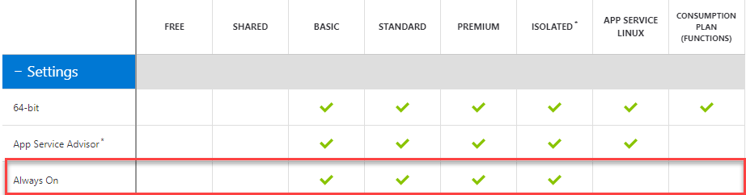
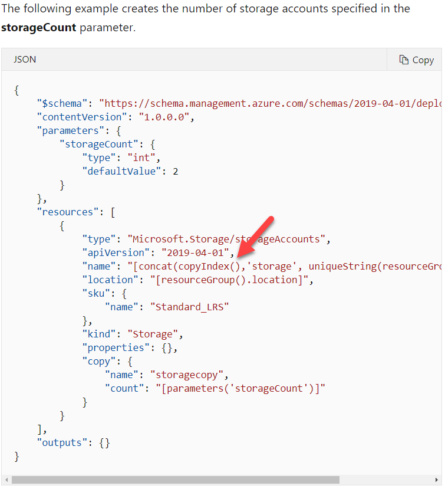
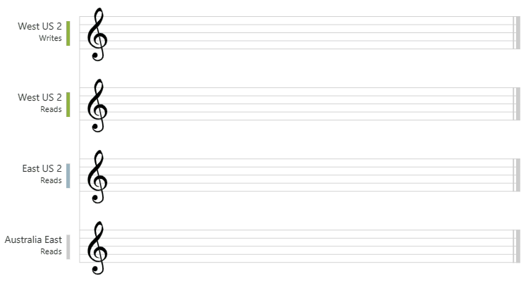
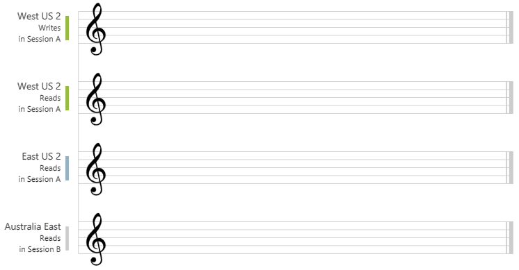

- [Monitor, troubleshoot, and optimize Azure solutions](#monitor-troubleshoot-and-optimize-azure-solutions)
    - [**Question**: Ensure that the cost of Application insights does not exceed a pre-set budget](#question-ensure-that-the-cost-of-application-insights-does-not-exceed-a-pre-set-budget)
  - [Redis cache](#redis-cache)
    - [**Question**: Establish connection to the cache](#question-establish-connection-to-the-cache)
    - [**Question**: Invalidate the cache](#question-invalidate-the-cache)
    - [**Question**: Store value in cache](#question-store-value-in-cache)
    - [**Question**: Get value for cache](#question-get-value-for-cache)
- [Connect to and consume Azure services and third-party services](#connect-to-and-consume-azure-services-and-third-party-services)
  - [Azure Service Bus](#azure-service-bus)
    - [**Question**: Create an Azure Service Bus Namespace with PS](#question-create-an-azure-service-bus-namespace-with-ps)
    - [**Question**: Which of the following are best practices when it compes to maximizing the throughput of the queue when the number of senders is large, and the number of receivers is less?](#question-which-of-the-following-are-best-practices-when-it-compes-to-maximizing-the-throughput-of-the-queue-when-the-number-of-senders-is-large-and-the-number-of-receivers-is-less)
    - [**Question**: The messaging system needs to have the following properties: Provide transactional support, SUpport duplicate detection of messages, Messages should never expire. What should you use?](#question-the-messaging-system-needs-to-have-the-following-properties-provide-transactional-support-support-duplicate-detection-of-messages-messages-should-never-expire-what-should-you-use)
  - [Azure Event Hubs](#azure-event-hubs)
    - [**Question**: Get connection string from existine Azure Event Hubs](#question-get-connection-string-from-existine-azure-event-hubs)
    - [**Question**: What would you use to store the end-user agreements?](#question-what-would-you-use-to-store-the-end-user-agreements)
  - [Event Grid](#event-grid)
    - [**Question**: Configure Event Grid service filters so that your application only receives events from teh virtual machine service or the devtestlab service.](#question-configure-event-grid-service-filters-so-that-your-application-only-receives-events-from-teh-virtual-machine-service-or-the-devtestlab-service)
    - [**Question** How to Monitor virtual machine changes, and send email to IT Admin?](#question-how-to-monitor-virtual-machine-changes-and-send-email-to-it-admin)
- [Develop Azure compute solutions](#develop-azure-compute-solutions)
    - [**Question**: You have to move blobs from one container to another across storage accounts. You decided to use Azure CLI tool to implement this requirement. Would this fulfil the requirement?](#question-you-have-to-move-blobs-from-one-container-to-another-across-storage-accounts-you-decided-to-use-azure-cli-tool-to-implement-this-requirement-would-this-fulfil-the-requirement)
    - [**Question**: How to log only errors for an Azure Web App service?](#question-how-to-log-only-errors-for-an-azure-web-app-service)
    - [**Question**: Your app needs to be running all the time. Whats the most effective plan?](#question-your-app-needs-to-be-running-all-the-time-whats-the-most-effective-plan)
    - [**Question**: Create 3 copies of storage account](#question-create-3-copies-of-storage-account)
    - [**Question**: At times the Azure Function erros out with a Timeout expired exception. This may have occured because all pooled connections were in use and max pool size was reached.](#question-at-times-the-azure-function-erros-out-with-a-timeout-expired-exception-this-may-have-occured-because-all-pooled-connections-were-in-use-and-max-pool-size-was-reached)
- [Develop fo Azure storage](#develop-fo-azure-storage)
  - [Cosmos DB](#cosmos-db)
    - [Consistency levels](#consistency-levels)
  - [Blob storage](#blob-storage)
    - [**Question** How would you call for implementing a blob lease?](#question-how-would-you-call-for-implementing-a-blob-lease)
    - [**Question**: You have to use the `AzCopy` tool to download a set of blobs from a container. WHich is the least privileged role that needs to be assinged to the storage account for this requirement?](#question-you-have-to-use-the-azcopy-tool-to-download-a-set-of-blobs-from-a-container-which-is-the-least-privileged-role-that-needs-to-be-assinged-to-the-storage-account-for-this-requirement)
    - [You have to fetch and set the Metadata for the blobs in the storage account via a .Net Module. What is the right sequence of steps?](#you-have-to-fetch-and-set-the-metadata-for-the-blobs-in-the-storage-account-via-a-net-module-what-is-the-right-sequence-of-steps)
- [Implement Azure security](#implement-azure-security)
    - [**Question**: Your team has the ability to view resources and they are able to create support tickets for all subscriptions. What do you need to add to the Action section for the custom role?](#question-your-team-has-the-ability-to-view-resources-and-they-are-able-to-create-support-tickets-for-all-subscriptions-what-do-you-need-to-add-to-the-action-section-for-the-custom-role)
# Monitor, troubleshoot, and optimize Azure solutions

### **Question**: Ensure that the cost of Application insights does not exceed a pre-set budget
- Implement adaptive sampling using the Application Insights SDK
## Redis cache
### **Question**: Establish connection to the cache
```
IDatabase db = redisConnection.GetDatabase();
```
### **Question**: Invalidate the cache
```
cache.KeyDelete(p_Customer);
```

### **Question**: Store value in cache
```
bool wasSet = db.StringSet("favorite:flavor", "i-love-rocky-road");
```
### **Question**: Get value for cache
```
string value = db.StringGet("favorite:flavor");
```

# Connect to and consume Azure services and third-party services

## Azure Service Bus
### **Question**: Create an Azure Service Bus Namespace with PS
- New-AzServiceBusNamespace -ResourceGroupName "whizlabs-rg" -Location "EastUs" -Name "whizlabsnamespace" -SkuName "Standard"

### **Question**: Which of the following are best practices when it compes to maximizing the throughput of the queue when the number of senders is large, and the number of receivers is less?
- If the sender resides in a different process, use a single factory per process
- Leave batches store access enabled
- Use asynchronous operations to take advantage of client-side batching
- Set the prefetch count to 20 times the maximum processing rates of all receivers of a factory.

### **Question**: The messaging system needs to have the following properties: Provide transactional support, SUpport duplicate detection of messages, Messages should never expire. What should you use?
- Azure Service Bus Queue
- Azure Service Bus topic
## Azure Event Hubs
### **Question**: Get connection string from existine Azure Event Hubs
```
az eventhubs eventhub authorization-rule keys list --resource-group MyResourceGroupName --namespace-name MyNamespaceName --eventhub-name MyEventHubName --name MyAuthRuleName
```
### **Question**: What would you use to store the end-user agreements?
- Azure Event Hubs - Based on the number of agreements generated per hour, it's best to first ingest the data into Azure Event Hubs. Once the agreements are ingested into Azure Event Hubs, store the user's agreements data into aAzure Blob storage.
## Event Grid
### **Question**: Configure Event Grid service filters so that your application only receives events from teh virtual machine service or the devtestlab service.
```
"advancedFilters": [
    {
        "operatorType": "StringCOntains",
        "key": "Subject",
        "values": [
            "/providers/microsoft.devtestlab/",
            "/providers/Microsoft.Compute/VirtualMachines/"
        ]
    }
]
```
### **Question** How to Monitor virtual machine changes, and send email to IT Admin?
- By using Azure Event Grid and Logic apps.
- If you want your logic app to run only when a specific event or operation happens add a `condition` that checks for the `Microsoft.Compute/virtualMachines/write` operation.

# Develop Azure compute solutions
### **Question**: You have to move blobs from one container to another across storage accounts. You decided to use Azure CLI tool to implement this requirement. Would this fulfil the requirement?
- Yes

### **Question**: How to log only errors for an Azure Web App service?
- `--only-show-errors`

### **Question**: Your app needs to be running all the time. Whats the most effective plan?
- Basic App Service plan


### **Question**: Create 3 copies of storage account
- `copyIndex()` returns the current iteration in the loop.


### **Question**: At times the Azure Function erros out with a Timeout expired exception. This may have occured because all pooled connections were in use and max pool size was reached.
- Edit the `host.json` file and change the `batchSize` property 
# Develop fo Azure storage
## Cosmos DB
### Consistency levels
- **Strong** - The reads are guaranteed to return the most recent committed version of an item.

- **Bounded staleness** - The reads might lag behind writes by at most "K" versions (that is, "updates") of an item or by "T" time interval, whichever is reached first.

- **Session** - In session consistency, within a single client session reads are guaranteed to honor the consistent-prefix, monotonic reads, monotonic writes, read-your-writes, and write-follows-reads guarantees. The following graphic illustrates the session consistency with musical notes. The "West US 2 writer" and the "West US 2 reader" are using the same session (Session A) so they both read the same data at the same time. Whereas the "Australia East" region is using "Session B" so, it receives data later but in the same order as the writes.

- **Consistent prefix** - In consistent prefix option, updates that are returned contain some prefix of all the updates, with no gaps. Consistent prefix consistency level guarantees that reads never see out-of-order writes.

- **Eventual** - In eventual consistency, there's no ordering guarantee for reads. 


## Blob storage
### **Question** How would you call for implementing a blob lease?
- `comp=lease`

### **Question**: You have to use the `AzCopy` tool to download a set of blobs from a container. WHich is the least privileged role that needs to be assinged to the storage account for this requirement?
- Storage Blob Data Reader

### You have to fetch and set the Metadata for the blobs in the storage account via a .Net Module. What is the right sequence of steps?
- `GetProperties()` or `GetPropertiesAsync()` to get the Metadata collection
- Set metadata with `Metadata.Add()`
- then call `SetMetadata()` or `SetMetadataAsync()` on the blob client.

# Implement Azure security
### **Question**: Your team has the ability to view resources and they are able to create support tickets for all subscriptions. What do you need to add to the Action section for the custom role?
- "*/read","Microsoft.Support/*"