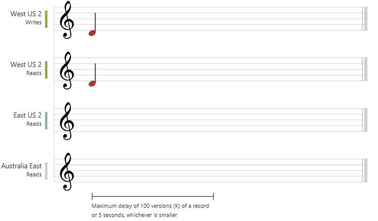
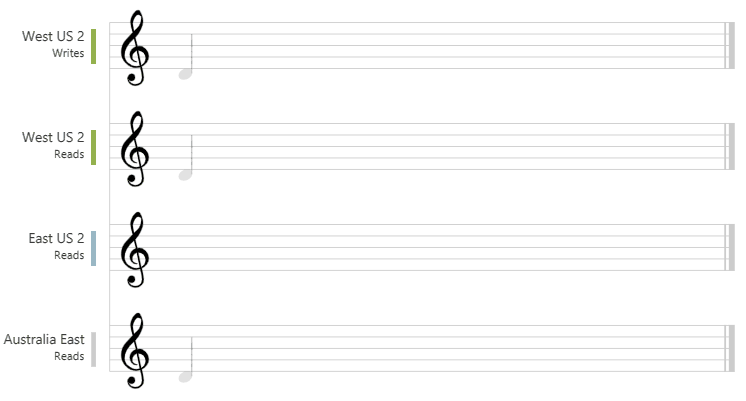
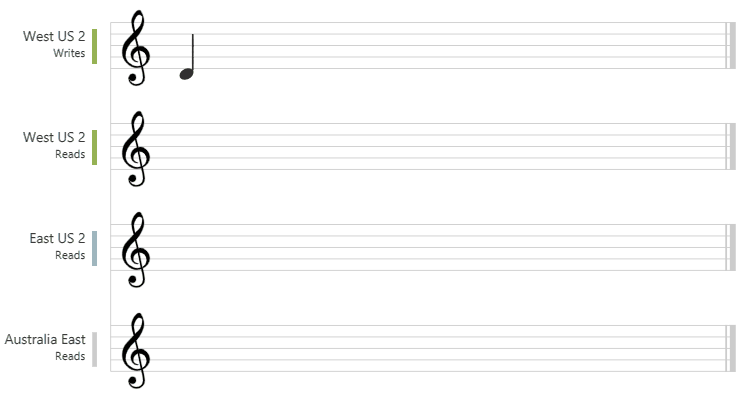
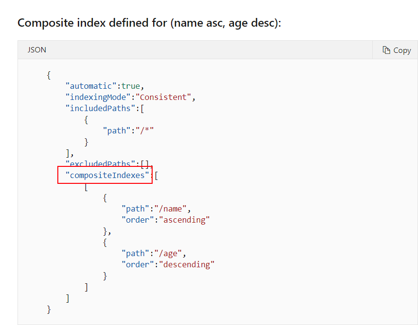
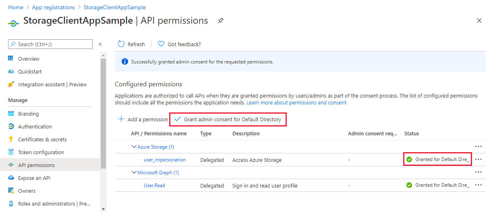

- [Monitor, troubleshoot, and optimize Azure solutions](#monitor-troubleshoot-and-optimize-azure-solutions)
    - [**Question**: Does Azure Front Door support the MIME type?](#question-does-azure-front-door-support-the-mime-type)
    - [**Question**: Does Azure Front Door support the compression type?](#question-does-azure-front-door-support-the-compression-type)
    - [**Question**: Ensure that the cost of Application insights does not exceed a pre-set budget](#question-ensure-that-the-cost-of-application-insights-does-not-exceed-a-pre-set-budget)
    - [**Question**: All of the video content must expire from the cache after an hour. The videos of varying quality must be delivered from the closest regional point of presence. Which of the following would you choose for the caching behaviour?](#question-all-of-the-video-content-must-expire-from-the-cache-after-an-hour-the-videos-of-varying-quality-must-be-delivered-from-the-closest-regional-point-of-presence-which-of-the-following-would-you-choose-for-the-caching-behaviour)
  - [Redis cache](#redis-cache)
    - [**Question**: Establish connection to the cache](#question-establish-connection-to-the-cache)
    - [**Question**: Invalidate the cache](#question-invalidate-the-cache)
    - [**Question**: Store value in cache](#question-store-value-in-cache)
    - [**Question**: Get value for cache](#question-get-value-for-cache)
- [Connect to and consume Azure services and third-party services](#connect-to-and-consume-azure-services-and-third-party-services)
  - [Azure Service Bus](#azure-service-bus)
    - [**Question**: Create an Azure Service Bus Namespace with PS](#question-create-an-azure-service-bus-namespace-with-ps)
    - [**Question**: Which of the following are best practices when it compes to maximizing the throughput of the queue when the number of senders is large, and the number of receivers is less?](#question-which-of-the-following-are-best-practices-when-it-compes-to-maximizing-the-throughput-of-the-queue-when-the-number-of-senders-is-large-and-the-number-of-receivers-is-less)
    - [**Question**: The messaging system needs to have the following properties: Provide transactional support, SUpport duplicate detection of messages, Messages should never expire. What should you use?](#question-the-messaging-system-needs-to-have-the-following-properties-provide-transactional-support-support-duplicate-detection-of-messages-messages-should-never-expire-what-should-you-use)
    - [Azure Service bus topic filters](#azure-service-bus-topic-filters)
  - [Azure Event Hubs](#azure-event-hubs)
    - [**Question**: Get connection string from existing Azure Event Hubs](#question-get-connection-string-from-existing-azure-event-hubs)
    - [**Question**: What would you use to store the end-user agreements?](#question-what-would-you-use-to-store-the-end-user-agreements)
    - [**Question**: Using Azure Event Hubs for ingestion of events from multiple IoT enabled devices, you need to ensure that the events are persisted to Azure Blob Storage](#question-using-azure-event-hubs-for-ingestion-of-events-from-multiple-iot-enabled-devices-you-need-to-ensure-that-the-events-are-persisted-to-azure-blob-storage)
  - [Event Grid](#event-grid)
    - [**Question**: Configure Event Grid service filters so that your application only receives events from teh virtual machine service or the devtestlab service.](#question-configure-event-grid-service-filters-so-that-your-application-only-receives-events-from-teh-virtual-machine-service-or-the-devtestlab-service)
    - [**Question** How to Monitor virtual machine changes, and send email to IT Admin?](#question-how-to-monitor-virtual-machine-changes-and-send-email-to-it-admin)
    - [**Question**: Resources used by the Azure Logic App must be secured to the corporate virtual network and also use the dedicated storage resources with a fixed costing model. How would you secure the logic app?](#question-resources-used-by-the-azure-logic-app-must-be-secured-to-the-corporate-virtual-network-and-also-use-the-dedicated-storage-resources-with-a-fixed-costing-model-how-would-you-secure-the-logic-app)
  - [Logic apps](#logic-apps)
    - [**Question**: You have to develop a workflow in the Azure Logic App service to perform the following action: Trigger the workflow whenever a dealocation activity o curs for a virtual machine.](#question-you-have-to-develop-a-workflow-in-the-azure-logic-app-service-to-perform-the-following-action-trigger-the-workflow-whenever-a-dealocation-activity-o-curs-for-a-virtual-machine)
- [Develop Azure compute solutions](#develop-azure-compute-solutions)
    - [**Question**: You have to move blobs from one container to another across storage accounts. You decided to use Azure CLI tool to implement this requirement. Would this fulfil the requirement?](#question-you-have-to-move-blobs-from-one-container-to-another-across-storage-accounts-you-decided-to-use-azure-cli-tool-to-implement-this-requirement-would-this-fulfil-the-requirement)
    - [**Question**: How to log only errors for an Azure Web App service?](#question-how-to-log-only-errors-for-an-azure-web-app-service)
    - [**Question**: Your app needs to be running all the time. Whats the most effective plan?](#question-your-app-needs-to-be-running-all-the-time-whats-the-most-effective-plan)
    - [**Question**: Create 3 copies of storage account](#question-create-3-copies-of-storage-account)
    - [**Question**: At times the Azure Function errors out with a Timeout expired exception. This may have occurred because all pooled connections were in use and max pool size was reached.](#question-at-times-the-azure-function-errors-out-with-a-timeout-expired-exception-this-may-have-occurred-because-all-pooled-connections-were-in-use-and-max-pool-size-was-reached)
    - [**Question**: You have to view the diagnostic information about the container during the startup process. Which of the following command would you execute to get the relevant information?](#question-you-have-to-view-the-diagnostic-information-about-the-container-during-the-startup-process-which-of-the-following-command-would-you-execute-to-get-the-relevant-information)
- [Develop fo Azure storage](#develop-fo-azure-storage)
    - [**Question**: Migrate multiple database sources to Azure](#question-migrate-multiple-database-sources-to-azure)
  - [Cosmos DB](#cosmos-db)
    - [Consistency levels](#consistency-levels)
    - [Question: Access console log from a container from Azure Web App](#question-access-console-log-from-a-container-from-azure-web-app)
    - [**Question**: You have an Azure Cosmos DB account of type SQL API. A sample items is given bellow:](#question-you-have-an-azure-cosmos-db-account-of-type-sql-api-a-sample-items-is-given-bellow)
  - [Blob storage](#blob-storage)
    - [**Question** How would you call for implementing a blob lease?](#question-how-would-you-call-for-implementing-a-blob-lease)
    - [**Question**: You have to use the `AzCopy` tool to download a set of blobs from a container. Which is the least privileged role that needs to be assigned to the storage account for this requirement?](#question-you-have-to-use-the-azcopy-tool-to-download-a-set-of-blobs-from-a-container-which-is-the-least-privileged-role-that-needs-to-be-assigned-to-the-storage-account-for-this-requirement)
    - [You have to fetch and set the Metadata for the blobs in the storage account via a .Net Module. What is the right sequence of steps?](#you-have-to-fetch-and-set-the-metadata-for-the-blobs-in-the-storage-account-via-a-net-module-what-is-the-right-sequence-of-steps)
- [Implement Azure security](#implement-azure-security)
    - [**Question**: Your team has the ability to view resources and they are able to create support tickets for all subscriptions. What do you need to add to the Action section for the custom role?](#question-your-team-has-the-ability-to-view-resources-and-they-are-able-to-create-support-tickets-for-all-subscriptions-what-do-you-need-to-add-to-the-action-section-for-the-custom-role)
    - [**Question**: Configure an ASP.Net Core application so that the user's permission can be used with the Azure Blob container](#question-configure-an-aspnet-core-application-so-that-the-users-permission-can-be-used-with-the-azure-blob-container)
    - [**Question**: Users must be able to log into the web application using their Azure Ad credentials. The personalization of the web application must be based on the membership in Active Directory groups. Configure the application manifest file.](#question-users-must-be-able-to-log-into-the-web-application-using-their-azure-ad-credentials-the-personalization-of-the-web-application-must-be-based-on-the-membership-in-active-directory-groups-configure-the-application-manifest-file)
# Monitor, troubleshoot, and optimize Azure solutions

### **Question**: Does Azure Front Door support the MIME type?
- Yes: Front Door can dynamically compress content on the edge, resulting in a smaller and faster response time to your clients. In order for a file to be eligible for compression, caching must be enabled and the file must of a MIME type to be eligible for compression.

### **Question**: Does Azure Front Door support the compression type?
- Yes: Supports `Gzip` and `Brotli` compression encodings. Additionally, the file must also be between 1KB and 8MB in size.
- 
### **Question**: Ensure that the cost of Application insights does not exceed a pre-set budget
- Implement adaptive sampling using the Application Insights SDK

### **Question**: All of the video content must expire from the cache after an hour. The videos of varying quality must be delivered from the closest regional point of presence. Which of the following would you choose for the caching behaviour?
- Override: Ignore origin-provided cache duration; use the provided cache duration instead. This will not override cache-control: no-cache
## Redis cache
### **Question**: Establish connection to the cache
```
IDatabase db = redisConnection.GetDatabase();
```
### **Question**: Invalidate the cache
```
cache.KeyDelete(p_Customer);
```

### **Question**: Store value in cache
```
bool wasSet = db.StringSet("favorite:flavor", "i-love-rocky-road");
```
### **Question**: Get value for cache
```
string value = db.StringGet("favorite:flavor");
```

# Connect to and consume Azure services and third-party services

## Azure Service Bus
### **Question**: Create an Azure Service Bus Namespace with PS
- New-AzServiceBusNamespace -ResourceGroupName "whizlabs-rg" -Location "EastUs" -Name "whizlabsnamespace" -SkuName "Standard"

### **Question**: Which of the following are best practices when it compes to maximizing the throughput of the queue when the number of senders is large, and the number of receivers is less?
- If the sender resides in a different process, use a single factory per process
- Leave batches store access enabled
- Use asynchronous operations to take advantage of client-side batching
- Set the pre-fetch count to 20 times the maximum processing rates of all receivers of a factory.

### **Question**: The messaging system needs to have the following properties: Provide transactional support, SUpport duplicate detection of messages, Messages should never expire. What should you use?
- Azure Service Bus Queue
- Azure Service Bus topic

### Azure Service bus topic filters
- `SQL Filters` - A SqlFilter holds a SQL-like conditional expression that is evaluated in the broker against the arriving messages' user-defined properties and system properties.
- `Boolean filters` - The TrueFilter and FalseFilter either cause all arriving messages (true) or none of the arriving messages (false) to be selected for the subscription.
- `Correlation Filters` - A CorrelationFilter holds a set of conditions that are matched against one or more of an arriving message's user and system properties. A common use is to match against the CorrelationId property, but the application can also choose to match against the following properties:
  - ContentType
  - Label
  - MessageId
  - ReplyTo
  - ReplyToSessionId
  - SessionId
  - To
  - any user-defined properties.
## Azure Event Hubs
### **Question**: Get connection string from existing Azure Event Hubs
```
az eventhubs eventhub authorization-rule keys list --resource-group MyResourceGroupName --namespace-name MyNamespaceName --eventhub-name MyEventHubName --name MyAuthRuleName
```
### **Question**: What would you use to store the end-user agreements?
- Azure Event Hubs - Based on the number of agreements generated per hour, it's best to first ingest the data into Azure Event Hubs. Once the agreements are ingested into Azure Event Hubs, store the user's agreements data into aAzure Blob storage.

### **Question**: Using Azure Event Hubs for ingestion of events from multiple IoT enabled devices, you need to ensure that the events are persisted to Azure Blob Storage
- Use **Event Hubs Capture** - Enables you to automatically capture the streaming data in Even Hubs in an Azure Blob storage or Azure Data Lake Storage Gen1or Gen 2

## Event Grid
### **Question**: Configure Event Grid service filters so that your application only receives events from teh virtual machine service or the devtestlab service.
```
"advancedFilters": [
    {
        "operatorType": "StringCOntains",
        "key": "Subject",
        "values": [
            "/providers/microsoft.devtestlab/",
            "/providers/Microsoft.Compute/VirtualMachines/"
        ]
    }
]
```
### **Question** How to Monitor virtual machine changes, and send email to IT Admin?
- By using Azure Event Grid and Logic apps.
- If you want your logic app to run only when a specific event or operation happens add a `condition` that checks for the `Microsoft.Compute/virtualMachines/write` operation.

### **Question**: Resources used by the Azure Logic App must be secured to the corporate virtual network and also use the dedicated storage resources with a fixed costing model. How would you secure the logic app?
- `Integration Service Environment`: is a fully isolated and dedicated environment for all enterprise-scale integration needs. When you create a new Integration Service Environment it is injected into your Azure virtual networks, which allows you to deploy Logic Apps as a service on your VNET.:
  - Direct, secure access to your virtual network resources.
  - Consistent, highly reliable performance.
  - Isolated, private storage
  - Predictable pricing. Provides a fixed monthly cost for Logic Apps

## Logic apps
### **Question**: You have to develop a workflow in the Azure Logic App service to perform the following action: Trigger the workflow whenever a dealocation activity o curs for a virtual machine.
- operationName property is equal to "Microsoft.Compute/virtualMachines/deallocate/action"


# Develop Azure compute solutions
### **Question**: You have to move blobs from one container to another across storage accounts. You decided to use Azure CLI tool to implement this requirement. Would this fulfil the requirement?
- Yes

### **Question**: How to log only errors for an Azure Web App service?
- `--only-show-errors`

### **Question**: Your app needs to be running all the time. Whats the most effective plan?
- Basic App Service plan


### **Question**: Create 3 copies of storage account
- `copyIndex()` returns the current iteration in the loop.\


### **Question**: At times the Azure Function errors out with a Timeout expired exception. This may have occurred because all pooled connections were in use and max pool size was reached.
- Edit the `host.json` file and change the `batchSize` property

### **Question**: You have to view the diagnostic information about the container during the startup process. Which of the following command would you execute to get the relevant information?
- `az container attach` : this command provides diagnostic information during container startup. Once the container has started, it streams STDOUT and STDERR to you local console.
# Develop fo Azure storage

### **Question**: Migrate multiple database sources to Azure
- Azure Database Migration Service
## Cosmos DB
### Consistency levels
- **Strong** - The reads are guaranteed to return the most recent committed version of an item. \

- **Bounded staleness** - The reads might lag behind writes by at most "K" versions (that is, "updates") of an item or by "T" time interval, whichever is reached first. \

- **Session** - In session consistency, within a single client session reads are guaranteed to honor the consistent-prefix, monotonic reads, monotonic writes, read-your-writes, and write-follows-reads guarantees. The following graphic illustrates the session consistency with musical notes. The "West US 2 writer" and the "West US 2 reader" are using the same session (Session A) so they both read the same data at the same time. Whereas the "Australia East" region is using "Session B" so, it receives data later but in the same order as the writes.

- **Consistent prefix** - In consistent prefix option, updates that are returned contain some prefix of all the updates, with no gaps. Consistent prefix consistency level guarantees that reads never see out-of-order writes.

- **Eventual** - In eventual consistency, there's no ordering guarantee for reads.


### Question: Access console log from a container from Azure Web App
```
az webapp log config --name whizlabwebapp --resource-group whizlab-rg --docker-container-logging

az webapp log tail --name whizlabwebapp --resource-group whizlab-rg
```

- To configure logging you need to use `az webapp log configure`.
- Configure gathering STDOUT and STDERR output from container with `--docker-container-logging`
- To get a live train of the logs for a web app `az webapp log tail`

### **Question**: You have an Azure Cosmos DB account of type SQL API. A sample items is given bellow:
```
{
  "customername" : "John",
  "city" : "New York"
}
```

You have to ensure the following query can be executed:
`select * from customers order by customername, city asc`

You have to define a policy for this.
**Answer:**


## Blob storage
### **Question** How would you call for implementing a blob lease?
- `comp=lease`

### **Question**: You have to use the `AzCopy` tool to download a set of blobs from a container. Which is the least privileged role that needs to be assigned to the storage account for this requirement?
- Storage Blob Data Reader

### You have to fetch and set the Metadata for the blobs in the storage account via a .Net Module. What is the right sequence of steps?
- `GetProperties()` or `GetPropertiesAsync()` to get the Metadata collection
- Set metadata with `Metadata.Add()`
- then call `SetMetadata()` or `SetMetadataAsync()` on the blob client.

# Implement Azure security
### **Question**: Your team has the ability to view resources and they are able to create support tickets for all subscriptions. What do you need to add to the Action section for the custom role?
- "*/read","Microsoft.Support/*"

### **Question**: Configure an ASP.Net Core application so that the user's permission can be used with the Azure Blob container


### **Question**: Users must be able to log into the web application using their Azure Ad credentials. The personalization of the web application must be based on the membership in Active Directory groups. Configure the application manifest file.
```
{
  "appId" : "<some guid>",
  "groupMemebrshipClaims" : "All",
  "oauth2AllowImplicitFlow" : "true"
}
```

- To get all the groups the user is part of, you need to set the `groupMembershipClaims`
- `oauth2AllowImplicitFlow` Specifies whether this web app can request OAuth2.0 implicit flow access tokens.