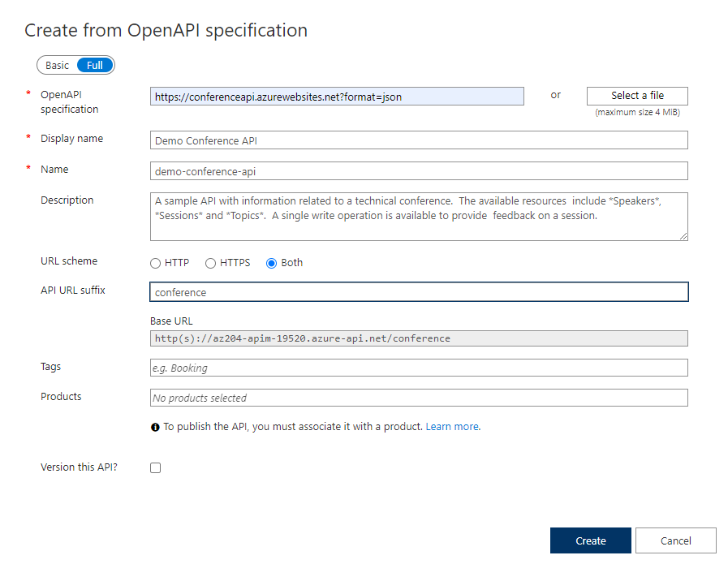
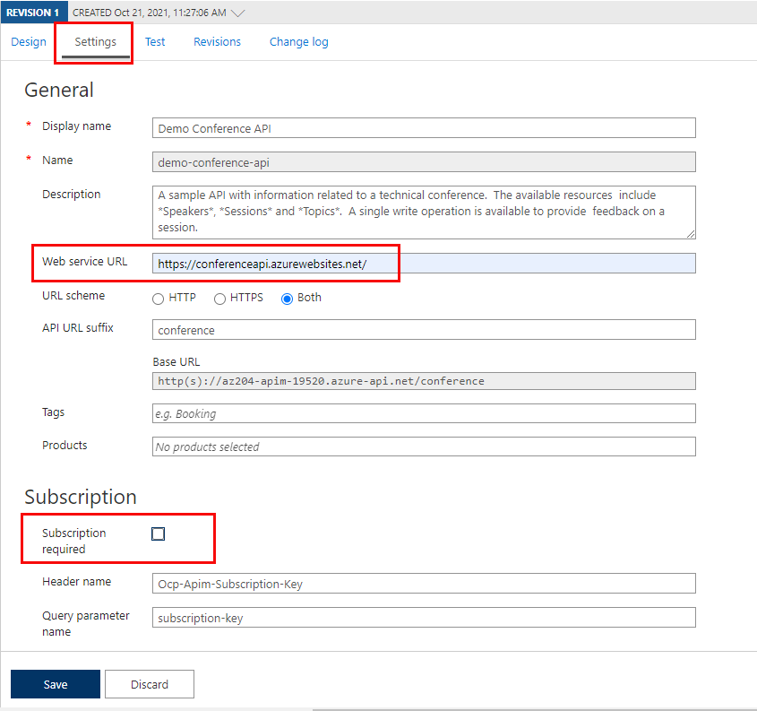
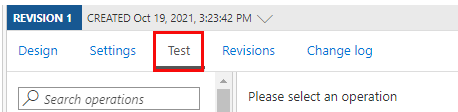

# Table of contents
- [Table of contents](#table-of-contents)
- [Exercise: Create a backend API](#exercise-create-a-backend-api)
  - [Login to Azure](#login-to-azure)
  - [Create an API Management instance](#create-an-api-management-instance)
  - [Import a backend API](#import-a-backend-api)
  - [Configure the backend settings](#configure-the-backend-settings)
  - [Test the API](#test-the-api)
  - [Clean up Azure resources](#clean-up-azure-resources)

# Exercise: Create a backend API

## Login to Azure
1. Login to the Azure portal and open the Cloud Shell.
2. After the shell opens be sure to select the Bash environment.

## Create an API Management instance

1. Let's set some variables for the CLI commands to use to reduce the amount of retyping. The APIM name needs to be a globally unique name, and the script below generates a random string. Replace <myEmail> with an email address you can access.
```
myApiName=az204-apim-$RANDOM
myLocation=<myLocation>
myEmail=<myEmail>
```
2. Create a resource group. The commands below will create a resource group named *az204-apim-rg.*
```
az group create --name az204-apim-rg --location $myLocation
```
3. Create an APIM instance. The `az apim create` command is used to create the instance. The `--sku-name Consumption` option is used to speed up the process for the walkthrough
```
az apim create -n $myApiName \
    --location $myLocation \
    --publisher-email $myEmail  \
    --resource-group az204-apim-rg \
    --publisher-name AZ204-APIM-Exercise \
    --sku-name Consumption
```

## Import a backend API
This section shows how to import and publish an OpenAPI specification backend API.

1. In the Azure portal, search for and select API Management services.
2. On the API Management screen, select the API Management instance you created.
3. Select APIs in the API management service navigation pane.


4. Select **OpenAPI** from the list and select Full in the pop-up.

Use the values from the table below to fill out the form. You can leave any fields not mentioned their default value.

| Setting |	 Value |	Description|
|---------|--------|----------------|
OpenAPI Specification |	https://conferenceapi.azurewebsites.net?format=json |	References the service implementing the API, requests are forwarded to this address. Most of the necessary information in the form is automatically populated after you enter this.
Display name |	Demo Conference API	| This name is displayed in the Developer portal.
Name |	demo-conference-api |	Provides a unique name for the API.
Description |	Automatically populated |	Provide an optional description of the API.
API URL suffix |	conference	|The suffix is appended to the base URL for the API management service. API Management distinguishes APIs by their suffix and therefore the suffix must be unique for every API for a given publisher.

5. Select **Create**

## Configure the backend settings
The Demo Conference API is created and a backend needs to be specified.

1. Select Settings in the blade to the right and enter https://conferenceapi.azurewebsites.net/ in the Web service URL field.
2. Deselect the Subscription required checkbox.


3. Select **Save**

## Test the API

Now that the API has been imported and the backend configured it is time to test the API.

1. Select Test.



2. Select **GetSpeakers**. The page shows Query parameters and Headers, if any. The `Ocp-Apim-Subscription-Key` is filled in automatically for the subscription key associated with this API.

3. Select **Send**.

Backend responds with 200 OK and some data.

## Clean up Azure resources
```
az group delete --name az204-apim-rg --no-wait
```