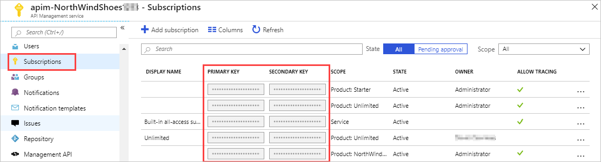
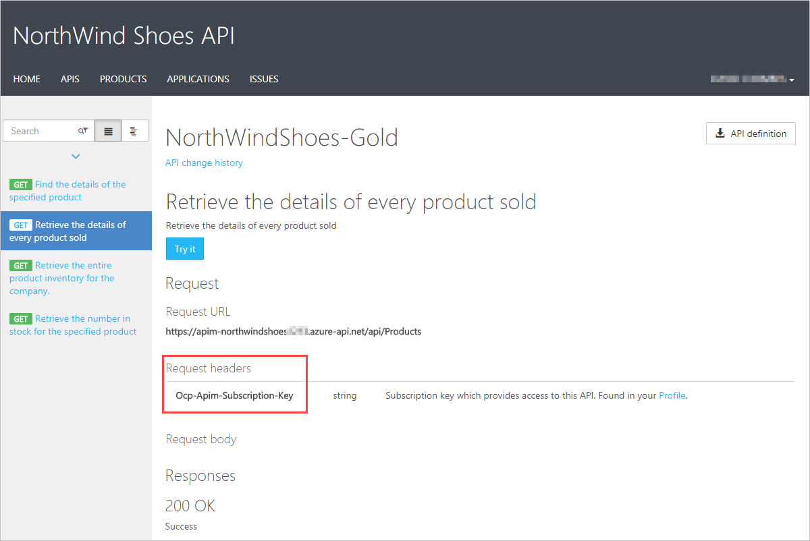

# Table of contents
- [Table of contents](#table-of-contents)
- [Discover the API Management service](#discover-the-api-management-service)
  - [Products](#products)
  - [Groups](#groups)
  - [Developers](#developers)
  - [Policies](#policies)
  - [Developer portal](#developer-portal)
- [Explore API gateways](#explore-api-gateways)
- [Explore API Management policies](#explore-api-management-policies)
  - [Understanding policy configuration](#understanding-policy-configuration)
  - [Examples](#examples)
    - [Apply policies specified at different scopes](#apply-policies-specified-at-different-scopes)
    - [Filter response content](#filter-response-content)
- [Create advanced policies](#create-advanced-policies)
  - [Control flow](#control-flow)
  - [Forward request](#forward-request)
  - [Limit concurrency](#limit-concurrency)
  - [Log to Event Hub](#log-to-event-hub)
  - [Mock response](#mock-response)
  - [Retry](#retry)
  - [Return response](#return-response)
- [Secure APIs by using subscriptions](#secure-apis-by-using-subscriptions)
  - [Subscriptions and Keys](#subscriptions-and-keys)
  - [Call an API with the subscription key](#call-an-api-with-the-subscription-key)
- [Secure APIs by using certificates](#secure-apis-by-using-certificates)
  - [Transport Layer Security client authentication](#transport-layer-security-client-authentication)
  - [Check the thumbprint of a client certificate](#check-the-thumbprint-of-a-client-certificate)
  - [Check the thumbprint against certificates uploaded to API Management](#check-the-thumbprint-against-certificates-uploaded-to-api-management)

# Discover the API Management service
API Management provides the core functionality to ensure a successful API program through developer engagement, business insights, analytics, security, and protection.

The system is made up of the following components:

- The **API gateway** is the endpoint that:
    - Accepts API calls and routes them to your backend(s).
    - Verifies API keys, JWT tokens, certificates and other credentials.
    - Enforces usage quotas and rate limits.
    - Transforms your API on the fly without code modifications.
    - Caches backend responses where set up.
    - Logs call metadata for analytics purposes

- The **Azure portal** is the administrative interface where you set up your API program. Use it to:
    - Define or import API schema
    - Package API's into products
    - Set up policies like quotas or transformations on th APIs
    - Get insights from analytics
    - Manage users

- The **Developer portal** serves as the main web presence for developers, where they can:
    - Read API documentation.
    - Try out an API via the interactive console
    - Create an account and subscribe to get API keys
    - Access analytics on their own usage.

## Products
Products are how APIs are surfaced to developers. Products in API Management have one or more APIs, and are configured with a title, description, and terms of use. Products can be Open or Protected. Protected products must be subscribed to before they can be used, while open products can be used without a subscription.  Subscription approval is configured at the product level and can either require administrator approval, or be auto-approved.

## Groups
Groups are used to manage the visibility of products to developers. API Management has the following immutable system groups:
- **Administrators** - Azure subscription administrators are members of this group. Administrators manage API Management service instances, creating the APIs, operations, and products that are used by developers.
- **Developers** - Developers are the customers that build applications using your APIs.
- **Guests** - Unauthenticated developer portal users, such as prospective customers visiting the developer portal of an API Management instance fall into this group.

In addition to these system groups, administrators can create custom groups

## Developers
Developers can be created or invited to join by administrators, or they can sign up from the Developer portal.

## Policies
Policies are a powerful capability of API Management that allow the Azure portal to change the behavior of the API through configuration.

## Developer portal
The developer portal is where developers can learn about your APIs, view and call operations, and subscribe to products.

# Explore API gateways

Your solution may contain several front- and back-end services. In this scenario, how does a client know what endpoints to call? What happens when new services are introduced, or existing services are refactored? How do services handle SSL termination, authentication, and other concerns? An API gateway can help to address these challenges.


An API gateway sits between clients and services. It acts as a reverse proxy, routing requests from clients to services.

However, there are some potential problems with exposing services directly to clients:

- It can result in complex client code. The client must keep track of multiple endpoints, and handle failures in a resilient way.
- It creates coupling between the client and the backend.
- A single operation might require calls to multiple services. 
- Each public-facing service must handle concerns such as authentication, SSL, and client rate limiting.
- Services must expose a client-friendly protocol such as HTTP or WebSocket. This limits the choice of communication protocols.
- Services with public endpoints are a potential attack surface, and must be hardened.

Gateways can perform a number of different functions, and you may not need all of them. The functions can be grouped into the following design patterns:

- **Gateway routing**: Use the gateway as a reverse proxy to route requests to one or more backend services, using layer 7 routing. The gateway provides a single endpoint for clients, and helps to decouple clients from services.
- **Gateway aggregation**: Use the gateway to aggregate multiple individual requests into a single request. 
- **Gateway Offloading**: Use the gateway to offload functionality from individual services to the gateway, particularly cross-cutting concerns. It can be useful to consolidate these functions into one place, rather than making every service responsible for implementing them. Here are some examples of functionality that could be offloaded to a gateway:
    - Authentication
    - IP allow/block list
    - Client rate limiting (throttling)
    - Logging and monitoring

# Explore API Management policies
In Azure API Management, policies are a powerful capability of the system that allow the publisher to change the behavior of the API through configuration. Policies are a collection of Statements that are executed sequentially on the request or response of an API.

Policies are applied inside the gateway which sits between the API consumer and the managed API. The gateway receives all requests and usually forwards them unaltered to the underlying API. However a policy can apply changes to both the inbound request and outbound response. Policy expressions can be used as attribute values or text values in any of the API Management policies, unless the policy specifies otherwise.

## Understanding policy configuration
The policy definition is a simple XML document that describes a sequence of inbound and outbound statements.

The configuration is divided into `inbound`, `backend`, `outbound`, and `on-error`. The series of specified policy statements is executes in order for a request and a response.

```
<policies>
  <inbound>
    <!-- statements to be applied to the request go here -->
  </inbound>
  <backend>
    <!-- statements to be applied before the request is forwarded to
         the backend service go here -->
  </backend>
  <outbound>
    <!-- statements to be applied to the response go here -->
  </outbound>
  <on-error>
    <!-- statements to be applied if there is an error condition go here -->
  </on-error>
</policies>
```

## Examples
### Apply policies specified at different scopes
If you have a policy at the global level and a policy configured for an API, then whenever that particular API is used both policies will be applied. API Management allows for deterministic ordering of combined policy statements via the base element.

```
<policies>
    <inbound>
        <cross-domain />
        <base />
        <find-and-replace from="xyz" to="abc" />
    </inbound>
</policies>
```

In the example policy definition above, the `cross-domain` statement would execute before any higher policies which would in turn, be followed by the `find-and-replace` policy.

### Filter response content
The policy defined in example below demonstrates how to filter data elements from the response payload based on the product associated with the request.

```
<policies>
  <inbound>
    <base />
  </inbound>
  <backend>
    <base />
  </backend>
  <outbound>
    <base />
    <choose>
      <when condition="@(context.Response.StatusCode == 200 && context.Product.Name.Equals("Starter"))">
        <!-- NOTE that we are not using preserveContent=true when deserializing response body stream into a JSON object since we don't intend to access it again. See details on https://docs.microsoft.com/azure/api-management/api-management-transformation-policies#SetBody -->
        <set-body>
          @{
            var response = context.Response.Body.As<JObject>();
            foreach (var key in new [] {"minutely", "hourly", "daily", "flags"}) {
            response.Property (key).Remove ();
           }
          return response.ToString();
          }
    </set-body>
      </when>
    </choose>
  </outbound>
  <on-error>
    <base />
  </on-error>
</policies>
```

# Create advanced policies
This unit provides a reference for the following API Management policies:

- Control flow - Conditionally applies policy statements based on the results of the evaluation of Boolean expressions.
- Forward request - Forwards the request to the backend service.
- Limit concurrency - Prevents enclosed policies from executing by more than the specified number of requests at a time.
- Log to Event Hub - Sends messages in the specified format to an Event Hub defined by a Logger entity.
- Mock response - Aborts pipeline execution and returns a mocked response directly to the caller.
- Retry - Retries execution of the enclosed policy statements, if and until the condition is met. Execution will repeat at the specified time intervals and up to the specified retry count.

## Control flow
The choose policy applies enclosed policy statements based on the outcome of evaluation of boolean expressions, similar to an if-then-else or a switch construct in a programming language.

```
<choose>
    <when condition="Boolean expression | Boolean constant">
        <!— one or more policy statements to be applied if the above condition is true  -->
    </when>
    <when condition="Boolean expression | Boolean constant">
        <!— one or more policy statements to be applied if the above condition is true  -->
    </when>
    <otherwise>
        <!— one or more policy statements to be applied if none of the above conditions are true  -->
</otherwise>
</choose>
```

The control flow policy must contain at least one `<when/>` element. The `<otherwise/>` element is optional.

## Forward request
The `forward-request` policy forwards the incoming request to the backend service specified in the request context. \
Removing this policy results in the request not being forwarded to the backend service and the policies in the outbound section are evaluated immediately upon the successful completion of the policies in the inbound section.

```
<forward-request timeout="time in seconds" follow-redirects="true | false"/>
```

## Limit concurrency
The `limit-concurrency` policy prevents enclosed policies from executing by more than the specified number of requests at any time. 

```
<limit-concurrency key="expression" max-count="number">
        <!— nested policy statements -->
</limit-concurrency>
```

## Log to Event Hub
The `log-to-eventhub` policy sends messages in the specified format to an Event Hub defined by a Logger entity.
```
<log-to-eventhub logger-id="id of the logger entity" partition-id="index of the partition where messages are sent" partition-key="value used for partition assignment">
  Expression returning a string to be logged
</log-to-eventhub>
```

## Mock response
The `mock-response`, as the name implies, is used to mock APIs and operations. It aborts normal pipeline execution and returns a mocked response to the caller.

```
<mock-response status-code="code" content-type="media type"/>
```

## Retry
The `retry` policy executes its child policies once and then retries their execution until the retry `condition` becomes `false` or retry `count` is exhausted.

```
<retry>
    condition="boolean expression or literal"
    count="number of retry attempts"
    interval="retry interval in seconds"
    max-interval="maximum retry interval in seconds"
    delta="retry interval delta in seconds"
    first-fast-retry="boolean expression or literal">
        <!-- One or more child policies. No restrictions -->
</retry>
```

## Return response
The `return-response` policy aborts pipeline execution and returns either a default or custom response to the caller. Default response is `200 OK` with no body. 

```
<return-response response-variable-name="existing context variable">
  <set-header/>
  <set-body/>
  <set-status/>
</return-response>
```

# Secure APIs by using subscriptions

It is easy and it's common to secure access to the API by using subscription keys that developers can include with HTTP requests when they are making calls.
Developers need to subscribe to get keys, this can happen without the approval of the API publisher.

> NOTE: API Management also supports other mechanisms for securing access to APIs, including: OAuth2.0, Client certificates, and IP allow listing.

## Subscriptions and Keys
A subscription key is a unique auto-generated key that can be passed through in the headers of the client request or as a query string parameter.

You can regenerate these subscription keys at any time, for example, if you suspect that a key has been shared with unauthorized users.


## Call an API with the subscription key
The default header name is Ocp-Apim-Subscription-Key, and the default query string is subscription-key.

To test out your API calls, you can use the developer portal, or command-line tools, such as curl. Here's an example of a `GET` request using the developer portal, which shows the subscription key header:


Here's how you can pass a key in the request header using curl:
```
curl --header "Ocp-Apim-Subscription-Key: <key string>" https://<apim gateway>.azure-api.net/api/path
```
Here's an example curl command that passes a key in the URL as a query string:
```
curl https://<apim gateway>.azure-api.net/api/path?subscription-key=<key string>
```

If the key is not passed in the header, or as a query string in the URL, you'll get a **401 Access Denied** response

# Secure APIs by using certificates
Certificates can be used to provide Transport Layer Security (TLS) mutual authentication between the client and the API gateway. You can configure the API Management gateway to allow only requests with certificates containing a specific thumbprint. The authorization at the gateway level is handled through inbound policies.

## Transport Layer Security client authentication
With TLS client authentication, the API Management gateway can inspect the certificate contained within the client request and check for properties like: Certificate Authority (CA), Thumbprint, Subject, Expiration Date

## Check the thumbprint of a client certificate
The following example checks the thumbprint of the certificate passed in the request:
```
<choose>
    <when condition="@(context.Request.Certificate == null || context.Request.Certificate.Thumbprint != "desired-thumbprint")" >
        <return-response>
            <set-status code="403" reason="Invalid client certificate" />
        </return-response>
    </when>
</choose>
```

## Check the thumbprint against certificates uploaded to API Management
Obtain the certificates from your partners and use the Client certificates page in the Azure portal to upload them to the API Management resource. Then add this code to your policy:
```
<choose>
    <when condition="@(context.Request.Certificate == null || !context.Request.Certificate.Verify()  || !context.Deployment.Certificates.Any(c => c.Value.Thumbprint == context.Request.Certificate.Thumbprint))" >
        <return-response>
            <set-status code="403" reason="Invalid client certificate" />
        </return-response>
    </when>
</choose>
```
