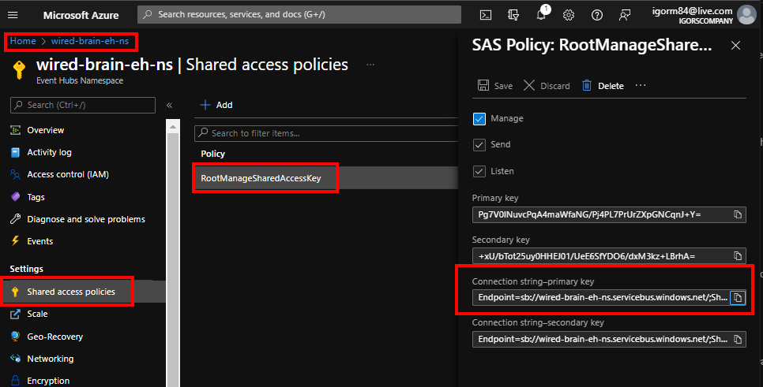

# Table of content
- [Event Hub Fundamentals](#Event-Hub-Fundamentals)
    - [Scenarios](#Scenarios)
    - [Components](#Components)
- [Create Azure Event hubs](#Create-Azure-Event-hubs)

# Event Hub Fundamentals
- Event Hub is scalable
- Good for big data scenarios
- With millions of events / second
- Decouples the sending and receiving of data
- Integration with Azure and non-Azure services.
- Capture events directly to Azure blob storage and data lake as they come in

## Scenarios
- Telemetry - Big data coming from array of sensors that capture readings frequently
- Data archival
- Transaction processing - millions of events coming through every second in a financial institution
- Anomaly detection - check the events in real time

## Components
- **Namespace**: a container for one or more Event Hubs(a grouping if you will)
- **Event producers** - Applications that send data to the Event Hubs
- **Partitions** - Within an Event Hub messages get delivered to a partition. Think about a partition as a bucket. A message comes in, then the next one behind it, and there will be more than 1 partition per event hub.
    - Hold events time-ordered as they arrive
    - Events not deleted once read (get deleted after retention period)
    - Event Hubs decides which partition events are sent to (can specify partition with partition key)
    - Maximum of 32 partitions
    - Create as many as expected concurrent subscribers
- **Consumer groups** - A particular view of the Event Hub, where we can see where an application read is within a partition, with multiple consumer groups we can support multiple applications reading through the events all in their own pase 
- **Subscribers** - applications that read events contained within the event hub.

# Example
## Create Azure Event hubs

1. Create namespace for the Event Hub
```
az eventhubs namespace create \
--name wired-brain-eh-ns \
--resource-group event-hub-rg \
-l uksouth \
--sku Standard
```

2. Create the *Event Hub*
```
az eventhubs eventhub create \
--name wired-brain-eh-hub \
--namespace wired-brain-eh-ns \
-g event-hub-rg \
--message-retention 1  # can be between 1 and 7
```

## Send Events to Event Hub
- Install .Net SDK
- Obtain connection info - Namespace and endpoint, endpoint will include key
- Open connection - Using `EventHubProducerClient` (It's ok to cache this object)
- Prepare data - Convert to binary
- Send Data - Single or batch events. Size of the data can be 1Mb

1. Create a new console app
```
dotnet new console
```

2. Add `Azure.Messaging.EventHubs`
```
dotnet add package Azure.Messaging.EventHubs
```

3. Set the event hub name that we have created in a previous step into a variable:

```
private const string eventHubName = "wired-brain-eh-hub";
```

4. Set the connection string to another variable. You can get this from the Azure portal, from the namespace

> NOTE: this current policy gives access to everything. For more restrictive access you should create new policies.

5. Call `SendToRandomPartition` from the main method
```
static async Task SendToRandomPartition()
{
    await using var producerClient = 
        new EventHubProducerClient(connectionString, eventHubName);

    using EventDataBatch eventDataBatch = 
        await producerClient.CreateBatchAsync();

    for (int i = 0; i < 100; i++)
    {
        double waterTemp = (rand.NextDouble()) * 100;
        int coffeTypeIndex = rand.Next(2);

        var coffeMachineData = new CoffeeData()
        {
            WaterTemperature = waterTemp,
            ReadingTime = DateTime.Now,
            CoffeeType = CoffeeData.AllCoffeeTypes[coffeTypeIndex]
        };

        var coffeMachineDataBytes = 
            JsonSerializer.SerializeToUtf8Bytes(coffeMachineData);

        var eventData = new EventData(coffeMachineDataBytes);

        if (!eventDataBatch.TryAdd(eventData))
        {
            throw new Exception("Cannot add coffee machine data to random batch");
        }
    }

    await producerClient.SendAsync(eventDataBatch);

    Console.WriteLine("Wrote events to random partitions");
}
```

```
class CoffeeData
{
    public static string[] AllCoffeeTypes = {"a", "b", "c"};
    public double WaterTemperature { get; set; }
    public DateTime ReadingTime { get; set; }
    public string CoffeeType { get; set; }
}
```

5.a. If you would like all the events to go to the same partition you could do the following:
```
var options = new SendEventOptions();
options.PartitionKey = "device1"; // It doesn't matter what this is as long as it is the same name;

await producerClient.SendAsync(eventBatch, options);

Console.WriteLine("Wrote events to single partition");
```

## Read events from Event Hubs
- Install .Net SDK
- Obtain connection info - Namespace and endpoint, endpoint will include key
- Open connection - Using `EventHubConsumerClient` or `EventProcessorClient`
- Retrieve data - the connection does not close after the read is done
- Decode data

1. Create a new console app
```
dotnet new console
```

2. Add `Azure.Messaging.EventHubs`
```
dotnet add package Azure.Messaging.EventHubs
```

3. Get the app name and connection string the same way as in the previous example

4. Get the info about the existing partitions
```
static async Task GetPartitionInfo()
{
    await using var consumerClient =
        new EventHubConsumerClient(consumerGroup, connectionString, eventHubName);

    var partitionIds = await consumerClient.GetPartitionIdsAsync();

    foreach ( var id in partitionIds )
    {
        var partitionInfo = await consumerClient.GetPartitionPropertiesAsync(id);

        Console.WriteLine("**** NEW PARTITION INFO ****");
        Console.WriteLine($"Partition Id: " +
            $"{partitionInfo.Id}{Environment.NewLine}" +
            $"Empty? {partitionInfo.IsEmpty}{Environment.NewLine}" +
            $"Last Sequence: {partitionInfo.LastEnqueuedSequenceNumber}");
    }
}
```

Running this will give you back a result similar to this:
```
**** NEW PARTITION INFO ****
Partition Id: 0 
Empty? True     
Last Squence: -1
**** NEW PARTITION INFO ****
Partition Id: 1
Empty? False
Last Squence: 99
**** NEW PARTITION INFO ****
Partition Id: 2
Empty? False
Last Squence: 99
**** NEW PARTITION INFO ****
Partition Id: 3
Empty? True
Last Squence: -1
```
Notice that from the 3 partitions only 2 has data.

5. Read the data from Even Hub
```
static async Task ReadFromPartition(string partitionNumber)
{
    var cancelationToken = new CancellationTokenSource();
    cancelationToken.CancelAfter(TimeSpan.FromSeconds(120));

    await using( var consumerClient = new EventHubConsumerClient(consumerGroup, connectionString, eventHubName))
    {
        try
        {
            PartitionProperties props = await consumerClient.GetPartitionPropertiesAsync(partitionNumber);

            EventPosition startingPosition = 
                EventPosition.FromSequenceNumber(
                    props.LastEnqueuedSequenceNumber
                    // props.BeginningSequenceNumber
                    );

            // Read the events comming into the partition until the cancellation token timer runs out and stops it
            await foreach( PartitionEvent partitionEvent in consumerClient.ReadEventsFromPartitionAsync(partitionNumber, startingPosition, cancelationToken.Token))
            {
                Console.WriteLine("**** NEW COFFEE ****")
;
                string partitionId = partitionEvent.Partition.PartitionId;
                var sequenceNumber = partitionEvent.Data.SequenceNumber;
                var key = partitionEvent.Data.PartitionKey;

                Console.WriteLine($"Paritiotn Id: {partitionId}{Environment.NewLine}" +
                    $"Sequence Number: {sequenceNumber}" +
                    $"Partition Key: {key}");

                var coffee = JsonSerializer.Deserialize<CoffeeData>(partitionEvent.Data.EventBody);

                Console.WriteLine($"Type: {coffee.CoffeeType}{Environment.NewLine}" +
                    $"Temp: {coffee.WaterTemperature}{Environment.NewLine}" +
                    $"");

            }
        }
        catch (Exception ex)
        {
            Console.WriteLine(ex.ToString());
        }
        finally
        {
            await consumerClient.CloseAsync();
        }
    }
}
```