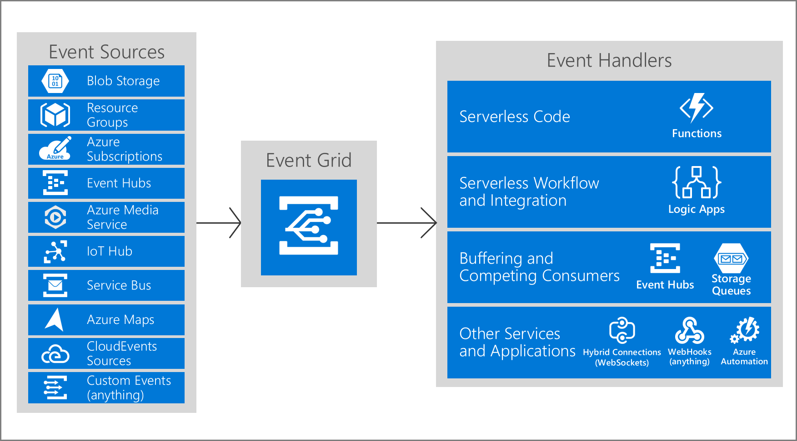

# Table of content
- [Introduction](#introduction)
- [Explore Azure Event Grid](#Explore-Azure-Event-Grid)
    - [Concepts in Azure Event Grid](#Concepts-in-Azure-Event-Grid)
    - [Events](#Events)
    - [Event sources](#Event-sources)
    - [Topics](#topics)
    - [Event subscriptions](#Event-subscriptions)
    - [Event handlers](#Event-handlers)
- [Discover event schemas](#Discover-event-schemas)
    - [Event schema](#Event-schema)
    - [Event properties](#Event-properties)
    - [CloudEvents v1.0 schema](#CloudEvents-v1.0-schema)
- [Explore event delivery durability](#Explore-event-delivery-durability)
    - [Retry schedule](#Retryschedule)
    - [Retry policy](#Retry-policy)
    - [Output batching](#Output-batching)
    - [Delayed delivery](#Delayed-delivery)
    - [Dead-letter events](#Dead-letter-events)
    - [Custom delivery properties](#Custom-delivery-properties)
- [Control access to events](#Control-access-to-events)
    - [Built-in roles](#Built-in-roles)
    - [Permissions for event subscriptions](#Permissions-for-event-subscriptions)
- [Receive events by using webhooks](#Receive-events-by-using-webhooks)
    - [Endpoint validation with Event Grid events](#Endpoint-validation-with-Event-Grid-events)
- [Filter events](#Filter-events)
    - [Event type filtering](#Event-type-filtering)
    - [Subject filtering](#Subject-filtering)
    - [Advanced filtering](#Advanced-filtering)

# Introduction
Azure Event Grid is deeply integrated with Azure services and can be integrated with third-party services. Event Grid efficiently and reliably routes events from Azure and non-Azure resources, and distributes the events to registered subscriber endpoints.

# Explore Azure Event Grid
It uses the publish-subscribe model. Publishers emit events, but have no expectation about how the events are handled. Subscribers decide on which events they want to handle.\
You can use filters to route specific events to different endpoints, multicast to multiple endpoints, and make sure your events are reliably delivered.\
How Event Grid connects sources and handlers:


## Concepts in Azure Event Grid
- **Events** - What happened
- **Event sources** - Where the event took place.
- **Topics** - The endpoint where publishers send events.
- **Event subscriptions** - The endpoint or built-in mechanism to route event, sometimes to more than 1 handler.
- **Event handlers** - The app or service reacting to the event.

## Events
An event is the smallest amount of information that fully describes something that happened in the system.
An event of size up to 64 KB is covered by General Availability (GA) Service Level Agreement (SLA). The support for an event of size up to 1 MB is currently in preview. Events over 64 KB are charged in 64-KB increments.

## Event sources
An event source is where the event happens. Each event source is related to one or more event types. For example, Azure Storage is the event source for blob created events.

## Topics
The event grid topic provides an endpoint where the source sends events. The publisher creates the event grid topic, and decides whether an event source needs one topic or more than one topic. A topic is used for a collection of related events. To respond to certain types of events, subscribers decide which topics to subscribe to.

## Event subscriptions
A subscription tells Event Grid which events on a topic you're interested in receiving.When creating the subscription, you provide an endpoint for handling the event.

## Event handlers
From an Event Grid perspective, an event handler is the plae where the event is sent.

# Discover event schemas
Events consists of a set of four required string properties. The properties are common to all events from any publisher. The data object has properties that are specific to each publisher. \
Event sources send events to Azure Event Grid in an array, which can have several event objects. When posting events to an event grid topic, the array can have a total size of up to 1MB.Operations are charged in a 64 KB increments though.\
Event Grid sends events to subscribers in an array that has a single event.

## Event schema
```
[
  {
    "topic": string,
    "subject": string,
    "id": string,
    "eventType": string,
    "eventTime": string,
    "data":{
      object-unique-to-each-publisher
    },
    "dataVersion": string,
    "metadataVersion": string
  }
]
```

## Event properties
All events have the same following top-level data:\
| Property | Type | Required | Description |
|----------|------|----------|-------------|
topic | string | No. If not included, Event Grid will stamp onto the event. If included it must match the event grid topic Azure Resource Manager ID exactly. | Full resource path to the event source. This field isn't writeable. Event Gri provides this value.
subject | string | Yes | publisher-defined path to the event subject.
eventType | string | Yes | One of the registered event types for this event source.
EventTime | string | Yes | The time of the event is generated in UTC
id | string | Yes | Unique identifier for the event.
data | object | No | Event data specific to the resource provider.
dataVersion |string | No | The schema version of the data object.
metadataVersion | string | No. If included, must match the Event Grid Schema `metadataVersion` exactly. | The schema version of the event metadata.

For custom topics, the event publisher determines the data object. The top-level data should have the same fields as standard resource-defined events. Subscribers use the `subject` to filter and route events. Consider providing the path for where the event happened, so subscribers can filter by segments of that path. Sometimes your subject needs more detail about what happened. For example, the Storage Accounts publisher provides the subject `/blobServices/default/containers/<container-name>/blobs/<file>` when a file is added to a container. A subscriber could filter by the path `/blobServices/default/containers/testcontainer` to get all events for that container but not other containers in the storage account. 

## CloudEvents v1.0 schema
In addition to its default event schema, Azure Event Grid natively supports events in the JSON implementation of CloudEvents v1.0 and HTTP protocol binding. CloudEvents is an open specification for describing event data. With a common schema, you can more easily integrate work across platforms.\
Here is an example of an Azure Blob Storage event in CloudEvents format:
```
{
    "specversion": "1.0",
    "type": "Microsoft.Storage.BlobCreated",  
    "source": "/subscriptions/{subscription-id}/resourceGroups/{resource-group}/providers/Microsoft.Storage/storageAccounts/{storage-account}",
    "id": "9aeb0fdf-c01e-0131-0922-9eb54906e209",
    "time": "2019-11-18T15:13:39.4589254Z",
    "subject": "blobServices/default/containers/{storage-container}/blobs/{new-file}",
    "dataschema": "#",
    "data": {
        "api": "PutBlockList",
        "clientRequestId": "4c5dd7fb-2c48-4a27-bb30-5361b5de920a",
        "requestId": "9aeb0fdf-c01e-0131-0922-9eb549000000",
        "eTag": "0x8D76C39E4407333",
        "contentType": "image/png",
        "contentLength": 30699,
        "blobType": "BlockBlob",
        "url": "https://gridtesting.blob.core.windows.net/testcontainer/{new-file}",
        "sequencer": "000000000000000000000000000099240000000000c41c18",
        "storageDiagnostics": {
            "batchId": "681fe319-3006-00a8-0022-9e7cde000000"
        }
    }
}
```
The headers values for events delivered in the CloudEvents schema and the Event Grid schema are the same except for `content-type`. For CloudEvents schema, that header value is `"content-type":"application/cloudevents+json; charset=utf-8"`. For Event Grid schema, that header value is "`content-type":"application/json; charset=utf-8"`.

# Explore event delivery durability
It tried to deliver each event at least once for each matching subscription immediately.  If a subscriber's endpoint doesn't acknowledge receipt of an event or if there is a failure, Event Grid retries delivery based on a fixed retry schedule and retry policy. By default, Event Grid delivers one event at a time to the subscriber, and the payload is an array with a single event.

## Retry schedule
When Event Grid receives an error for an event delivery attempt, EventGrid decides whether it should retry the delivery, dead-letter the event, or drop the event based on the type of the error.

The following table describes the types of endpoints and errors for which retry doesn't happen:
| Endpoint Type | Error codes |
|---------------|-------------|
Azure Resources | 400 Bad Request, 413 Request Entity Too Large, 403 Forbidden
Webhook | 400 Bad Request, 413 Request Entity Too Large, 403 Forbidden, 404 Not Found, 401 Unauthorized
> **Imortant!** If `Dead-Letter` isn't configured for an endpoint, events will be dropped when the above errors happen.

If the error returned by the subscribed endpoint isn't among the above list, Event Grid waits 30 seconds for a response after delivering a message. After 30 seconds, if the endpoint hasn’t responded, the message is queued for retry. Event Grid uses an exponential backoff retry policy for event delivery.

## Retry policy
An event is dropped if either of the limits of the retry policy is reached.
- **Maximum number of attempts** - The value must be an integer between 1 and 30. The default value is 30.
- **Event time-to-live (TTL)** - The value must be an integer between 1 and 1440. The default value is 1440 minutes.

The example below shows setting the maximum number of attempts to 18 by using the Azure CLI.
```
az eventgrid event-subscription create \
  -g gridResourceGroup \
  --topic-name <topic_name> \
  --name <event_subscription_name> \
  --endpoint <endpoint_URL> \
  --max-delivery-attempts 18
```

## Output batching
You can configure Event Grid to batch events for delivery for improved HTTP performance in high-throughput scenarios. Batching is turned off by default and can be turned on per-subscription via the portal, CLI, PowerShell, or SDKs.

Batched delivery has two settings:
- Max events per batch
- Preferred batch size in kilobytes

## Delayed delivery
As an endpoint experiences delivery failures, Event Grid will begin to delay the delivery and retry of events to that endpoint. 

## Dead-letter events
When Event Grid can't deliver an event within a certain time period or after trying to deliver the event a certain number of times, it can send the undelivered event to a storage account. \
Event Grid dead-letters an event when one of the following conditions is met:
- Event isn't delivered within the time-to-live period.
- The number of tries to deliver the event exceeds the limit.

## Custom delivery properties
Event subscriptions allow you to set up HTTP headers that are included in delivered events. This capability allows you to set custom headers that are required by a destination. You can set up to 10 headers when creating an event subscription. Each header value shouldn't be greater than 4,096 (4K) bytes. You can set custom headers on the events that are delivered to the following destinations:

- Webhooks
- Azure Service Bus topics and queues
- Azure Event Hubs
- Relay Hybrid Connections

# Control access to events
Event Grid uses Azure role-based access control (Azure RBAC).

## Built-in roles
| Role | Description |
|------|-------------|
Event Grid Subscription Reader | Lets you read Event Grid event subscriptions.
Event Grid Subscription Contributor | Lets you manage event Grid event subscription operations.
Event Grid Contributor | Lets you create and manage Event Grid resources.
Event Grid Data Sender | Lets you send event to Event Grid topics

The Event Grid Subscription Reader and Event Grid Subscription Contributor roles are for managing event subscriptions. They're important when implementing event domains because they give users the permissions they need to subscribe to topics in your event domain. These roles are focused on event subscriptions and don't grant access for actions such as creating topics.

The Event Grid Contributor role allows you to create and manage Event Grid resources.

## Permissions for event subscriptions
You must have the **Microsoft.EventGrid/EventSubscriptions/Write** permission on the resource that is the event source.
|Topic Type	|Description|
|-----------|-----------|
System topics |	Need permission to write a new event subscription at the scope of the resource publishing the event. The format of the resource is: `/subscriptions/{subscription-id}/resourceGroups/{resource-group-name}/providers/{resource-provider}/{resource-type}/{resource-name}`
Custom topics |	Need permission to write a new event subscription at the scope of the event grid topic. The format of the resource is: `/subscriptions/{subscription-id}/resourceGroups/{resource-group-name}/providers/Microsoft.EventGrid/topics/{topic-name}`

# Receive events by using webhooks
Webhooks are one of the many ways to receive events from Azure Event Grid. When a new event is ready, Event Grid service POSTs an HTTP request to the configured endpoint with the event in the request body. Event Grid requires you to prove ownership of your Webhook endpoint before it starts delivering events to that endpoint. 

## Endpoint validation with Event Grid events
If you're using any other type of endpoint, such as an HTTP trigger based Azure function, your endpoint code needs to participate in a validation handshake with Event Grid. Event Grid supports two ways of validating the subscription.
- **Synchronous handshake**
- **Asynchronous handshake**

# Filter events
When creating an event subscription, you have three options for filtering:

- Event types
- Subject begins with or ends with
- Advanced fields and operators

## Event type filtering
The JSON syntax for filtering by event type is:
```
"filter": {
  "includedEventTypes": [
    "Microsoft.Resources.ResourceWriteFailure",
    "Microsoft.Resources.ResourceWriteSuccess"
  ]
}
```

## Subject filtering
The JSON syntax for filtering by subject is:
```
"filter": {
  "subjectBeginsWith": "/blobServices/default/containers/mycontainer/log",
  "subjectEndsWith": ".jpg"
}
```

## Advanced filtering
To filter by values in the data fields and specify the comparison operator, use the advanced filtering option. In advanced filtering, you specify the:

- operator type - The type of comparison.
- key - The field in the event data that you're using for filtering. It can be a number, boolean, or string.
- value or values - The value or values to compare to the key.
The JSON syntax for using advanced filters is:

```
"filter": {
  "advancedFilters": [
    {
      "operatorType": "NumberGreaterThanOrEquals",
      "key": "Data.Key1",
      "value": 5
    },
    {
      "operatorType": "StringContains",
      "key": "Subject",
      "values": ["container1", "container2"]
    }
  ]
}
```