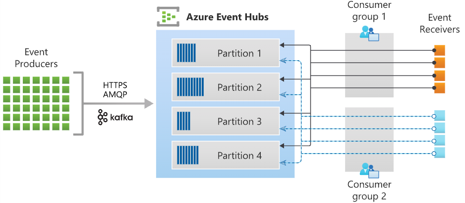

- [Introduction](#Introduction)
- [Discover Azure Event Hubs](#Discover-Azure-Event-Hubs)
- [Explore Event Hubs Capture](#Explore-Event-Hubs-Capture)
    - [How Event Hubs Capture works](#How-Event-Hubs-Capture-works)
    - [Capture windowing](#Capture-windowing)
    - [Scaling to throughput units](#Scaling-to-throughput-units)
- [Scale your processing application](#Scale-your-processing-application)
    - [Example scenario](#Example-scenario)
    - [Event processor or consumer client](#Event-processor-or-consumer-client)
    - [Partition ownership tracking](#Partition-ownership-tracking)
    - [Receive messages](#Receive-messages)
    - [Checkpointing](#Checkpointing)
    - [Thread safety and processor instances](#Thread-safety-and-processor-instances)
- [Control access to events](#Control-access-to-events)
    - [Authorize access with managed identities](#Authorize-access-with-managed-identities)
    - [Authorize access with Microsoft Identity Platform](#Authorize-access-with-Microsoft-Identity-Platform)
    - [Authorize access to Event Hubs publishers with shared access signatures](#Authorize-access-to-Event-Hubs-publishers-with-shared-access-signatures)
    - [Authorize access to Event Hubs consumers with shared access signatures](#Authorize-access-to-Event-Hubs-consumers-with-shared-access-signatures)
- [Perform common operations with the Event Hubs client library](#Perform-common-operations-with-the-Event-Hubs-client-library)
    - [Inspect an Event Hub](#Inspect-an-Event-Hub)
    - [Publish events to an Event Hub](#Publish-events-to-an-Event-Hub)
    - [Read events from an Event Hub](#Read-events-from-an-Event-Hub)
    - [Read events from an Event Hub partition](#Read-events-from-an-Event-Hub-partition)
    - [Process events using an Event Processor client](#Process-events-using-an-Event-Processor-client)

# Introduction
Azure Event Hubs is a big data streaming platform and event ingestion service. It can receive and process millions of events per second. 

# Discover Azure Event Hubs
Azure Event Hubs represents the "front door" for an event pipeline, often called an event ingestor in solution architectures. An event ingestor is a component or service that sits between event publishers and event consumers to decouple the production of an event stream from the consumption of those events. Event Hubs provides a unified streaming platform with time retention buffer, decoupling event producers from event consumers.

## Key concepts
Event Hubs contains the following key components:
- An **Event Hub client** is the primary interface for developers interacting with the Event Hubs client library. 
- An **Event Hub producer** is a type of client that serves as a source of telemetry data, diagnostics information, usage logs, or other log data, as part of an embedded device solution, a mobile device application, a game title running on a console or other device, some client or server based business solution, or a web site.
- An **Event Hub consumer** is a type of client which reads information from the Event Hub and allows processing of it.
-  A **partition** is an ordered sequence of events that is held in an Event Hub. Partitions are a means of data organization associated with the parallelism required by event consumers. 
- A **consumer group** is a view of an entire Event Hub. Consumer groups enable multiple consuming applications to each have a separate view of the event stream, and to read the stream independently at their own pace and from their own position. 
- **Event receivers**: Any entity that reads event data from an event hub.
- **Throughput units** or **processing units**: Pre-purchased units of capacity that control the throughput capacity of Event Hubs.



# Explore Event Hubs Capture
Azure Event Hubs enables you to automatically capture the streaming data in Event Hubs in an Azure Blob storage or Azure Data Lake Storage account of your choice


## How Event Hubs Capture works
Event Hubs is a time-retention durable buffer for telemetry ingress, similar to a distributed log. 
Captured data is written in Apache Avro format: a compact, fast, binary format that provides rich data structures with inline schema. This format is widely used in the Hadoop ecosystem, Stream Analytics, and Azure Data Factory. More information about working with Avro is available later in this article.

## Capture windowing
Event Hubs Capture enables you to set up a window to control capturing. This window is a minimum size and time configuration with a "first wins policy," meaning that the first trigger encountered causes a capture operation.
The storage naming convention is as follows:
```
{Namespace}/{EventHub}/{PartitionId}/{Year}/{Month}/{Day}/{Hour}/{Minute}/{Second}
```
Note that the date values are padded with zeroes; an example filename might be:
```
https://mystorageaccount.blob.core.windows.net/mycontainer/mynamespace/myeventhub/0/2017/12/08/03/03/17.avro
```

## Scaling to throughput units
Event Hubs traffic is controlled by throughput units. A single throughput unit allows 1 MB per second or 1000 events per second of ingress and twice that amount of egress. Standard Event Hubs can be configured with 1-20 throughput units, and you can purchase more with a quota increase support request. Standard Event Hubs can be configured with 1-20 throughput units, and you can purchase more with a quota increase support request. 

# Scale your processing application
To scale your event processing application, you can run multiple instances of the application and have it balance the load among themselves. 

>The key to scale for Event Hubs is the idea of partitioned consumers. In contrast to the competing consumers pattern, the partitioned consumer pattern enables high scale by removing the contention bottleneck and facilitating end to end parallelism.

## Example scenario
As an example scenario, consider a home security company that monitors 100,000 homes. Every minute, it gets data from various sensors such as motion detector, doo/window open sensor, glass break detector, and so on, installed in each home. The company provides a web site for residents to monitor the activity of their home in near real time.

Each sensor pushes data to an event hub. The een hub is configured with 16 partitions. On the consuming end, you need a mechanism that can read these, events consolidate them, and dump the aggregate to a storage blob, which is then projected to a user-friendly web page.

When designing the consumer in a distributed environment, the scenario must handle the following requirements:
- **Scale**: Crate multiple consumers, with each consumer taking ownership of reading from a few Event Hubs partitions.
-**Load balance**: Increase or reduce the consumers dynamically. For example, when a new sensor type is added to each home, the number of events increases. In that case, the operator (a human) increases the number of consumer instances. Then, the pool of consumers can rebalance the number of partitions they own, to share the load with the newly added consumers.
- ** Seamless resume on failures**: If a consumer fails, then other consumers can pick up the partitions owned by a consumer and continue.
- **Consume events**: While the previous three points deal with the management of the consumer, there must be code to consume the events and do something useful with it. For example, aggregate it and upload it to blob storage.

## Event processor or consumer client
 The Azure Event Hubs SDKs provide this functionality. In .NET or Java SDKs, you use an event processor client (`EventProcessorClient`), and in Python and JavaScript SDKs, you use `EventHubConsumerClient`.

 ## Partition ownership tracking
 An event processor instance typically owns and processes events from one or more partitions. Ownership of partitions is evenly distributed among all the active event processor instances associated with an event hub and consumer group combination.
 Each processor adds his own ID to the checkpoint store to claim ownership of a partition. This store contains data about all active instances.This data is then used to balance the load among the active processors.

 ## Receive messages
 When you create an event processor, you specify the functions that will process events and errors.

 ## Checkpointing
*Checkpointing* is a process by which an event processor marks or commits the position of the last successfully processed event within a partition. If an event processor disconnects from a partition, another instance can resume processing the partition at the checkpoint that was previously committed by the last processor of that partition in that consumer group.

## Thread safety and processor instances
By default, the function that processes the events is called sequentially for a given partition. Subsequent events and calls to this function from the same partition queue up behind the scenes as the event pump continues to run in the background on other threads. Events from different partitions can be processed concurrently and any shared state that is accessed across partitions have to be synchronized.

# Control access to events

Azure Event Hubs supports both Azure AD and Shared Access Signatures (SAS) to handle both authentication and authorization.
- Data Owner: Use this role to give *complete access* to Event Hubs resources
- Data Sender: Use this role to give *send access* to Event Hubs resources.
- Data Receive: Use this role to give *receiving access* to Event Hubs resources.

## Authorize access with managed identities
You need to configure Azure role-based access control settings for that managed identity. Azure Event Hubs defines Azure roles that encompass permissions for sending and reading from Event Hubs.

## Authorize access with Microsoft Identity Platform
You don't need to store credentials in code, instead you can request an OAuth 2.0 access token from Microsoft Identity Platform. Azure AD authenticates the security principal running the application. If authentication succeeds, Azure AD returns the access token to the application, and the application can then use the access token to authorize requests to Azure Event Hubs.

## Authorize access to Event Hubs publishers with shared access signatures
An event publisher defines a virtual endpoint for an Event Hub.
Each Event Hubs client is assigned a unique token which is uploaded to the client. A client that holds a token can only send to one publisher, and no other publisher. If multiple clients share the same token, then each of them shares the publisher.

## Authorize access to Event Hubs consumers with shared access signatures
To authenticate back-end applications that consume from the data generated by Event Hubs producers, Event Hubs token authentication requires its clients to either have the manage rights or the listen privileges assigned to its Event Hubs namespace or event hub instance or topic.

# Perform common operations with the Event Hubs client library
This unit contains examples of common operations you can perform with the Event Hubs client library (Azure.Messaging.EventHubs) to interact with an Event Hub.

## Inspect an Event Hub
Because partitions are owned by the Event Hub, their names are assigned at the time of creation. o understand what partitions are available, you query the Event Hub using one of the Event Hub clients. For illustration, the `EventHubProducerClient` is demonstrated in these examples, but the concept and form are common across clients.

```
var connectionString = "<< CONNECTION STRING FOR THE EVENT HUBS NAMESPACE >>";
var eventHubName = "<< NAME OF THE EVENT HUB >>";

await using (var producer = new EventHubProducerClient(connectionString, eventHubName))
{
    string[] partitionIds = await producer.GetPartitionIdsAsync();
}
```

## Publish events to an Event Hub
Producers publish events in batches and may request a specific partition, or allow the Event Hubs service to decide which partition events should be published to.  Our example will take advantage of automatic routing.

```
var connectionString = "<< CONNECTION STRING FOR THE EVENT HUBS NAMESPACE >>";
var eventHubName = "<< NAME OF THE EVENT HUB >>";

await using (var producer = new EventHubProducerClient(connectionString, eventHubName))
{
    using EventDataBatch eventBatch = await producer.CreateBatchAsync();
    eventBatch.TryAdd(new EventData(new BinaryData("First")));
    eventBatch.TryAdd(new EventData(new BinaryData("Second")));

    await producer.SendAsync(eventBatch);
}
```

## Read events from an Event Hub
In order to read events from an Event Hub, you'll need to create an `EventHubConsumerClient` for a given consumer group.

> NOTE: For production use, we recommend using the Event Processor Client, as it provides a more robust and performant experience.

```
var connectionString = "<< CONNECTION STRING FOR THE EVENT HUBS NAMESPACE >>";
var eventHubName = "<< NAME OF THE EVENT HUB >>";

string consumerGroup = EventHubConsumerClient.DefaultConsumerGroupName;

await using (var consumer = new EventHubConsumerClient(consumerGroup, connectionString, eventHubName))
{
    using var cancellationSource = new CancellationTokenSource();
    cancellationSource.CancelAfter(TimeSpan.FromSeconds(45));

    await foreach (PartitionEvent receivedEvent in consumer.ReadEventsAsync(cancellationSource.Token))
    {
        // At this point, the loop will wait for events to be available in the Event Hub.  When an event
        // is available, the loop will iterate with the event that was received.  Because we did not
        // specify a maximum wait time, the loop will wait forever unless cancellation is requested using
        // the cancellation token.
    }
}
```

## Read events from an Event Hub partition
To read from a specific partition, the consumer will need to specify where in the event stream to begin receiving events; in our example, we will focus on reading all published events for the first partition of the Event Hub.

```
var connectionString = "<< CONNECTION STRING FOR THE EVENT HUBS NAMESPACE >>";
var eventHubName = "<< NAME OF THE EVENT HUB >>";

string consumerGroup = EventHubConsumerClient.DefaultConsumerGroupName;

await using (var consumer = new EventHubConsumerClient(consumerGroup, connectionString, eventHubName))
{
    EventPosition startingPosition = EventPosition.Earliest;
    string partitionId = (await consumer.GetPartitionIdsAsync()).First();

    using var cancellationSource = new CancellationTokenSource();
    cancellationSource.CancelAfter(TimeSpan.FromSeconds(45));

    await foreach (PartitionEvent receivedEvent in consumer.ReadEventsFromPartitionAsync(partitionId, startingPosition, cancellationSource.Token))
    {
        // At this point, the loop will wait for events to be available in the partition.  When an event
        // is available, the loop will iterate with the event that was received.  Because we did not
        // specify a maximum wait time, the loop will wait forever unless cancellation is requested using
        // the cancellation token.
    }
}
```

## Process events using an Event Processor client
For most production scenarios, it is recommended that the EventProcessorClient be used for reading and processing events. Since the EventProcessorClient has a dependency on Azure Storage blobs for persistence of its state, you'll need to provide a BlobContainerClient for the processor, which has been configured for the storage account and container that should be used.

```
var cancellationSource = new CancellationTokenSource();
cancellationSource.CancelAfter(TimeSpan.FromSeconds(45));

var storageConnectionString = "<< CONNECTION STRING FOR THE STORAGE ACCOUNT >>";
var blobContainerName = "<< NAME OF THE BLOB CONTAINER >>";

var eventHubsConnectionString = "<< CONNECTION STRING FOR THE EVENT HUBS NAMESPACE >>";
var eventHubName = "<< NAME OF THE EVENT HUB >>";
var consumerGroup = "<< NAME OF THE EVENT HUB CONSUMER GROUP >>";

Task processEventHandler(ProcessEventArgs eventArgs) => Task.CompletedTask;
Task processErrorHandler(ProcessErrorEventArgs eventArgs) => Task.CompletedTask;

var storageClient = new BlobContainerClient(storageConnectionString, blobContainerName);
var processor = new EventProcessorClient(storageClient, consumerGroup, eventHubsConnectionString, eventHubName);

processor.ProcessEventAsync += processEventHandler;
processor.ProcessErrorAsync += processErrorHandler;

await processor.StartProcessingAsync();

try
{
    // The processor performs its work in the background; block until cancellation
    // to allow processing to take place.

    await Task.Delay(Timeout.Infinite, cancellationSource.Token);
}
catch (TaskCanceledException)
{
    // This is expected when the delay is canceled.
}

try
{
    await processor.StopProcessingAsync();
}
finally
{
    // To prevent leaks, the handlers should be removed when processing is complete.

    processor.ProcessEventAsync -= processEventHandler;
    processor.ProcessErrorAsync -= processErrorHandler;
}
```