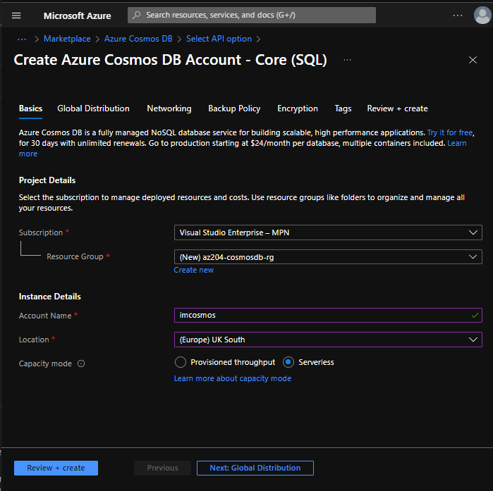
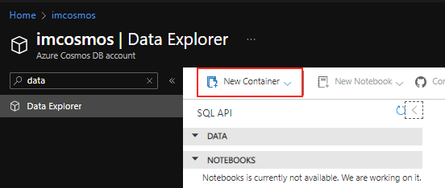
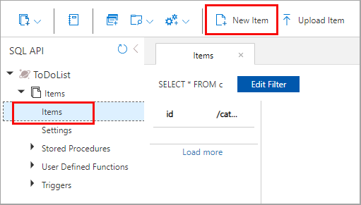

# Create an Azure Cosmos DB account

1. Log in to the Azure portal.
2. From the Azure portal navigation pane, select + **Create a resource**.
3. Search for **Azure Cosmos DB**, then select **Create/Azure Cosmos DB** to get started.
4. On the Select API option page, select **Create** in the **Core (SQL)** - Recommended box.
5. In the **Create Azure Cosmos DB Account - Core (SQL)** page, enter the basic settings for the new Azure Cosmos account.

- Subscription: Select the subscription you want to use.
- Resource Group: Select Create new, then enter az204-cosmos-rg.
- Account Name: Enter a unique name to identify your Azure Cosmos account. The name can only contain lowercase letters, numbers, and the hyphen (-) character. It must be between 3-31 characters in length.
- Location: Use the location that is closest to your users to give them the fastest access to the data.
- Capacity mode: Select Serverless.
6. Select **Review + create**.


## Add a database and a container
You can use the Data Explorer in the Azure portal to create a database and container.

1. Select **Data Explorer** from the left navigation on your Azure Cosmos DB account page, and then select **New Container**.


2. In the Add container pane, enter the settings for the new container.

- **Database ID**: Select **Create new**, and enter *ToDoList*.
- **Container ID**: Enter *Items*
- **Partition key**: Enter */category*. The samples in this demo use */category* as the partition key

## Add data to your database
Add data to your new database using Data Explorer
1. In Data Explorer, expand the ToDoList database, and expand the Items container. Next, select Items, and then select New Item.

2. Add the following structure to the document on the right side of the Documents pane:
```
{
    "id": "1",
    "category": "personal",
    "name": "groceries",
    "description": "Pick up apples and strawberries.",
    "isComplete": false
}
```
3. Select Save.

4. Select New Document again, and create and save another document with a unique id, and any other properties and values you want. Your documents can have any structure, because Azure Cosmos DB doesn't impose any schema on your data.
