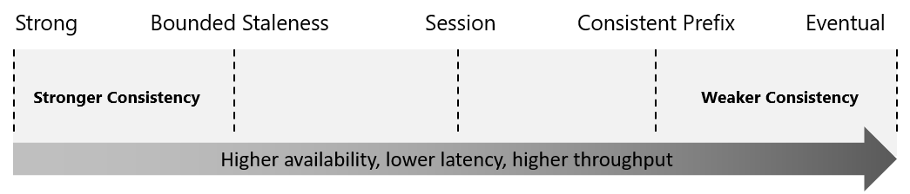

# Identify key benefits of Azure Cosmos DB

Azure Cosmos DB is designed to provide low latency, elastic scalability of throughput, well-defined semantics for data consistency, and high availability.

## Key benefits of global distribution
Running a database in multiple regions worldwide increases the availability of a database. If one region is unavailable other regions automatically handle application requests.\
The multi-master capability also enables:
- Unlimited elastic write and read scalability
- 99.999% read and write availability all around the world
- Guaranteed reads and writes served in less than 10 miliseconds at the 99th percentile.

# Explore the resource hierarchy
For globally distributing your data and throughput across multiple Azure regions, you can add and remove Azure regions to your account at any time.

## Elements in an Azure Cosmos account
After you create an account under your Azure subscription, you can manage the data in your account by creating databases, containers, and items.
The following image shows the hierarchy of different entities in an Azure Cosmos DB account

## Azure Cosmos containers
The items that you add to the container are automatically grouped into logical partitions, which are distributed across physical partitions, based on the partition key.

When you create a container, you configure throughput in one of the following modes:
- **Dedicated provisioned throughput mode**: THe throughput provisioned on a container is exclusively reserved for that container and it is backed by the SLA.
- **Shared provisioned throughput mode**: These containers share the provisioned throughput with the other containers in the same database (excluding containers that have been configured with dedicated provisioned throughput). In other words, the provisioned throughput on the database is shared amount all the "shared throughput" containers.

# Explore consistency levels
With Azure Cosmos DB, developers can choose from five well-defined consistency models on the consistency spectrum.
From strongest to more relaxed, the models include:
- strong
- bounded staleness
- session
- constant prefix
- eventual

# Choose the right consistency level
## SQL API and Table API
Consider the following points if your application is built using SQL API or Table API:
- For many real-world scenarios, session consistency is optimal and it's the recommended option.
- If your application requires strong consistency, it is recommended that you use bounded staleness consistency level.
- If you need stricter consistency guarantees than yhe ones provided by session consistency and single-digit millisecond latency for writes, it is recommended that you used bounded staleness consistency level.
- If your application requires eventual consistency, it is recommended that you use consistent prefix level.
- If you need less strict consistency guarantees than the ones provided by session consistency, it is recommended that you use consistent prefix level.
- IF you need the highest availability and the lowest latency, then use eventual consistency level.
- If you need even higher data durability without sacrificing performance, you can create a custom consistency level at the application layer.

# Discover request units
The cost to do a point read, which is fetching a single item by its ID and partition key value, for a 1KB item is 1RU. All other database operations are similarly assigned a cost using RUs. Whether the database operation is a write, point read, or query, costs are always measured in RUs.

The type of Azure Cosmos account you're using determines the way consumed RUs get charged. There are three modes in which you can create an account:

- **Provisioned throughput mode**: In this mode, you provision the number of RUs for your application on a per-second basis in increments of 100 RUs per second. To scale the provisioned throughput for your application, you can increase or decrease the number of RUs at any time in increments or decrements of 100 RUs. You can make your changes either programmatically or by using the Azure portal. You can provision throughput at container and database granularity level.

- **Serverless mode**: In this mode, you don't have to provision any throughput when creating resources in your Azure Cosmos account. At the end of your billing period, you get billed for the amount of request units that has been consumed by your database operations.

- **Autoscale mode**: In this mode, you can automatically and instantly scale the throughput (RU/s) of your database or container based on it's usage. This mode is well suited for mission-critical workloads that have variable or unpredictable traffic patterns, and require SLAs on high performance and scale.

