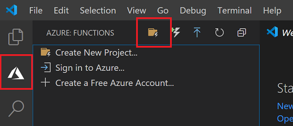
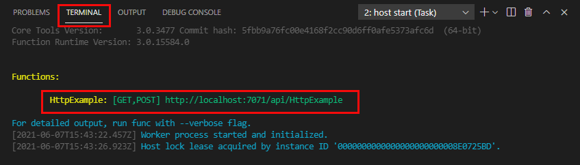
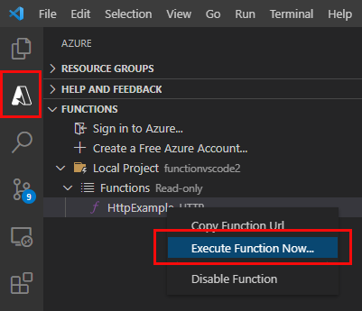

# Table of content
- [Table of content](#table-of-content)
- [Exercise: Create an Azure Function by using Visual Studio Code](#exercise-create-an-azure-function-by-using-visual-studio-code)
  - [Prerequisites](#prerequisites)
  - [Create your local project](#create-your-local-project)
  - [Run the function locally](#run-the-function-locally)
# Exercise: Create an Azure Function by using Visual Studio Code
In this exercise you'll learn how to create a simple C# function that responds to HTTP requests. After creating and testing the code locally in Visual Studio Code you will deploy to Azure.

## Prerequisites
- The [Azure Functions Core Tools](https://docs.microsoft.com/en-us/azure/azure-functions/functions-run-local?tabs=v4%2Cwindows%2Ccsharp%2Cportal%2Cbash%2Ckeda#install-the-azure-functions-core-tools) version 3.x.
- [.Net Core 3.1](https://dotnet.microsoft.com/en-us/download/dotnet/3.1)
-[C# Extension](https://marketplace.visualstudio.com/items?itemName=ms-dotnettools.csharp) in visual studio code
- [Azure Functions Extension](https://marketplace.visualstudio.com/items?itemName=ms-azuretools.vscode-azurefunctions) in visual studio code

## Create your local project
1. Choose the Azure icon in the Activity bar, then in the **Azure:Functions** area, select **Create new project**.

\
2. Choose a directory location for jour project
3. Provide the following information at the prompts:

- Select a language: Choose C#.
- Select a .NET runtime: Choose .NET Core 3.1
- Select a template for your project's first function: Choose HTTP - trigger.
- Provide a function name: Type HttpExample.
- Provide a namespace: Type My.Functions.
- Authorization level: Choose Anonymous, which enables anyone to call your function endpoint.
- Select how you would like to open your project: Choose Add to workspace.

## Run the function locally
1. Run the function by presing F5. Take note of the URL enpoint for the HTTP-trigger 

2. With Core Tools running , go to the **Azure:Functions** are. Under **Functions**, expand **Local Project > Functions**. Right-click the `HttpExample` function and then choose **Execute Function Now**.

3. In Enter request body type the request message body value of { "name": "Azure" }. Press Enter to send this request message to your function. When the function executes locally and returns a response, a notification is raised in Visual Studio Code. Information about the function execution is shown in Terminal panel.

4. Press Ctrl + C to stop Core Tools and disconnect the debugger.

