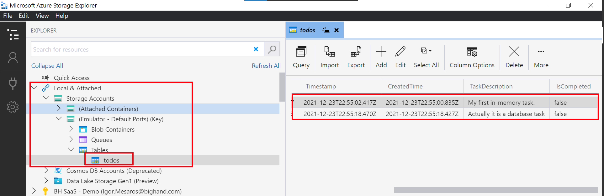

# Create a Rest API with Azure Functions

## Scenario
Create a REST API Todo List Application that supports the following operations:
- Get all Todo items
- Get Todo item by id
- Create new Todo item
- Update a Todo item
- Delete a Todo item

## Routing
|Operation | Default Route | REST Route |
|----------|---------------|------------|
Get all Todo items| api/GetAllTodos | GET api/todo
Get Todo item by id | api/GetTodoById | GET api/todo/{id}
Create new Todo item | api/CreateTodo | POST api/todo
Update a Todo item | api/UpdateTodo | PUT api/todo/{id}
Delete a Todo item | api/DeleteTodo | DELETE api/todo/{id}

## Implementation

1. Create Models
    ```
        public class Todo
        {
            public string Id { get; set; } = Guid.NewGuid().ToString("n");
            public DateTime CreatedTime { get; set; } = DateTime.UtcNow;
            public string TaskDescription { get; set; }
            public bool IsCompleted { get; set; }
        }

        // Only used by the client for creation to make sure the client cannot specify the `Id` and `CreatedTime`
        public class TodoCreateModel
        {
            public string TaskDescription { get; set; }
        }
    ```

2. Create Trigger `POST api/todo`
```
public static class TodoApi
{
    // This list will not clear in between calls if they are made in short succession.
    // However on Azure it does shut down from time to time so general best practice is to have Azure functions stateless
    // Futhermore when an Azure Function scales there will be multiple instances of the function so these values would not be available accross all isntances
    // This is only for demo purposes and will be changed
    static List<Todo> items = new List<Todo>();
    [FunctionName("CreateTodo")]
    public static async Task<IActionResult> CreateTodo(
        // Only allowing `post` method, and configuring a route of "todo"
        [HttpTrigger(AuthorizationLevel.Anonymous, "post", Route = "todo")]HttpRequest req, TraceWriter log
        )
    {
        log.Info("Createing a new todo list item");
        var requestBody = await new StreamReader(req.Body).ReadToEndAsync();
        var input = JsonConvert.DeserializeObject<TodoCreateModel>(requestBody);

        var todo = new Todo() { TaskDescription = input.TaskDescription };
        items.Add(todo);

        return new OkObjectResult(todo);
    }
}
```

3. Get All Todos `GET api/todo`
```
[FunctionName("GetTodods")]
public static IActionResult GetTodos(
    [HttpTrigger(AuthorizationLevel.Anonymous, "get", Route = "todo")]HttpRequest req, TraceWriter log)
{
    log.Info("Getting todo list items");
    return new OkObjectResult(items);
}
```

4. Get Todo by Id `GET api/todo/{id}`

Notice the route contains the `{id}` parameter
```
[FunctionName("GetTodoById")]
public static IActionResult GetTodoById(
    [HttpTrigger(AuthorizationLevel.Anonymous, "get", Route = "todo/{id}")]HttpRequest req,
    ILogger log, string id)
{
    var todo = items.FirstOrDefault(t => t.Id == id);
    if (todo == null)
    {
        return new NotFoundResult();
    }
    return new OkObjectResult(todo);
}
```

5. Update todo `PUT api/todo/{id}`
```
[FunctionName("UpdateTodo")]
public static async Task<IActionResult> UpdateTodo(
    [HttpTrigger(AuthorizationLevel.Anonymous, "put", Route = "todo/{id}")]HttpRequest request, ILogger log, string id
    )
{
    var todo = items.FirstOrDefault(t => t.Id == id);
    if(todo == null)
    {
        return new NotFoundResult();
    }

    var requestBody = await new StreamReader(request.Body).ReadToEndAsync();
    var updated = JsonConvert.DeserializeObject<TodoUpdateModel>(requestBody);

    todo.IsCompleted = updated.IsCompleted;
    if(!string.IsNullOrEmpty(updated.TaskDescription))
    {
        todo.TaskDescription = updated.TaskDescription;
    }

    return new OkObjectResult(todo);
}
```

Also create a new `TodoUpdateModel`:
```
public class TodoUpdateModel
{
    public bool IsCompleted { get; set; }
    public string TaskDescription { get; set; }
}
```
6. Delete Todo `DELETE api/todo/{id}`
```
[FunctionName("DeleteTodo")]
public static IActionResult DeleteTodo(
    [HttpTrigger(AuthorizationLevel.Anonymous, "delete", Route = "todo/{id}")]HttpRequest req, ILogger log, string id)
{
    var todo = items.FirstOrDefault(t => t.Id == id);
    if(todo == null)
    {
        return new NotFoundResult();
    }
    items.Remove(todo);

    return new OkResult();
}
```

7. Once the api is built and running within visual studio it can be tested using the [Postman Collection](https://github.com/igormesaros84/Az204/blob/master/Az-204/Implement%20Azure%20Functions/Examples/Create%20Azure%20functions%20by%20Visual%20Studio/ServerlessFuncs/Todo%20Api.postman_collection.json)

Solution can be found [here](https://github.com/igormesaros84/Az204/tree/master/Az-204/Implement%20Azure%20Functions/Examples/Create%20Azure%20functions%20by%20Visual%20Studio/ServerlessFuncs)

# Working with Triggers and Bindings
## Choosing a Database
| Cosmos DB | Table Storage |
|-----------|---------------|
Highly scalable | Extremely cheap
Globally distributed | Limited querying capabilities
Document Database | Emulated by Storage Emulator
Multiple programming models | Every Function App already has a Storage Account in Azure
Not as cheap as other options | Good choice fo initial prototype
Maybe overkill for this API | Can migrate to Cosmos DB later

## Updating the code
1. In a table storage table storage every table has a composite key consisting of a `PartitionKey` and `RowKey`. Add a new model that inherits from `TableEntity` that already has these properties defined:

```
public class TodoTableEntity : TableEntity
{
    public DateTime CreatedTime { get; set; }
    public string TaskDescription { get; set; }
    public bool IsCompleted { get; set; }
}
```

> `TableEntity` can should be used from `Microsoft.Azure.Cosmos.Table;`
2. Include the `Microsoft.Azure.WebJobs.Extensions.Storage` nuget package
> NOTE: They have for some reason removed `TableAttribute` from the nuget package above. [Until they add it back again](https://github.com/Azure/azure-sdk-for-net/issues/25342) you should use an earlier version 4 for this example.

3. Remove the list from the trigger code and pass in a table storage to the Create method:
```
public static async Task<IActionResult> CreateTodo(
    [HttpTrigger(AuthorizationLevel.Anonymous, "post", Route = "todo")]HttpRequest req, 
    [Table("todos", Connection = "AzureWebJobsStorage")]IAsyncCollector<TodoTableEntity> todoTable,
    ILogger log
    )
```
Specify a table named `todos` which will be created on demand.
`AzureWebJobsStorage` is the application setting name that contains the connection string. This can be found in `local.settings.json`.

4. Replace the code to add the todo item to the list so that it adds it to the table instead.
```
await todoTable.AddAsync(todo.ToTableEntity());
```

5. Replace `GetTodos` with this updated code:
```
[FunctionName("GetTodods")]
public static async Task<IActionResult> GetTodos(
    [HttpTrigger(AuthorizationLevel.Anonymous, "get", Route = "todo")]HttpRequest req, 
    [Table("todos", Connection = "AzureWebJobsStorage")] CloudTable todoTable,
    ILogger log)
{
    log.LogInformation("Getting todo list items");
    var query = new TableQuery<TodoTableEntity>();
    var segment = await todoTable.ExecuteQuerySegmentedAsync(query, null);

    return new OkObjectResult(segment.Select(Mappings.ToTodo));
}
```
and add the namespace usage
```
using Microsoft.Azure.Cosmos.Table;
```

6. Update `GetTodoById` with this code:
```
[FunctionName("GetTodoById")]
public static IActionResult GetTodoById(
    [HttpTrigger(AuthorizationLevel.Anonymous, "get", Route = "todo/{id}")]HttpRequest req,
    [Table("todos", "TODO", "{id}", Connection = "AzureWebJobsSTorage")] TodoTableEntity todo,
    ILogger log, string id)
{
    log.LogInformation("Getting todo item by id");
    if (todo == null)
    {
        log.LogInformation($"Item {id} not found");
        return new NotFoundResult();
    }
    return new OkObjectResult(todo);
}
```

Notice that the `TableAttribute` has 2 new parameters, `TODO` and `{id}` which are *PartitionKey* and *RowKey* for the underlying table.

7. Update `UpdateTodo` method with this code:
```
[FunctionName("UpdateTodo")]
public static async Task<IActionResult> UpdateTodo(
    [HttpTrigger(AuthorizationLevel.Anonymous, "put", Route = "todo/{id}")]HttpRequest req,
    [Table("todos", Connection = "AzureWebJobsStorage")] CloudTable todoTable,
    ILogger log, string id
    )
{
    var requestBody = await new StreamReader(req.Body).ReadToEndAsync();
    var updated = JsonConvert.DeserializeObject<TodoUpdateModel>(requestBody);
    var findOperation = TableOperation.Retrieve<TodoTableEntity>("TODO", id);
    var findResult = await todoTable.ExecuteAsync(findOperation);

    if (findResult.Result == null)
    {
        return new NotFoundResult();
    }
    var existingRow = (TodoTableEntity)findResult.Result;
    existingRow.IsCompleted = updated.IsCompleted;
    if (!string.IsNullOrEmpty(updated.TaskDescription))
    {
        existingRow.TaskDescription = updated.TaskDescription;
    }

    var replaceOperation = TableOperation.Replace(existingRow);
    await todoTable.ExecuteAsync(replaceOperation);
    return new OkObjectResult(existingRow.ToTodo());
}
```

8. Update `DeleteTodo` with the following code:
```
[FunctionName("DeleteTodo")]
public static async Task<IActionResult> DeleteTodo(
    [HttpTrigger(AuthorizationLevel.Anonymous, "delete", Route = "todo/{id}")]HttpRequest req,
    [Table("todos", Connection = "AzureWebJobsStorage")] CloudTable cloudTable,
    ILogger log, string id)
{
    log.LogInformation($"Delete item {id}.");
    var deleteOperation = TableOperation.Delete(
        new TableEntity() { PartitionKey = "TODO", RowKey = id, ETag = "*" });

    try
    {
        var deleteResult = await cloudTable.ExecuteAsync(deleteOperation);
    }
    catch(StorageException e) when (e.RequestInformation.HttpStatusCode == 404)
    {
        return new NotFoundResult();
    }

    return new OkResult();
}
```
`ETag = "*"` we supply a wildcard charter for the `ETag` specifying that we are happy to delete the row what ever version it may be. `ETag` are table storage's way of protecting you from concurrency issues.

# Testing changes

1. You can use the create method from the [Postman Collection](https://github.com/igormesaros84/Az204/blob/master/Az-204/Implement%20Azure%20Functions/Examples/Create%20Azure%20functions%20by%20Visual%20Studio/ServerlessFuncs/Todo%20Api.postman_collection.json) mentioned earlier to create a few todo elements.
2. Then you can open `Microsoft Azure Storage Explorer` and verify that the items have been created. As you can see in the `
 in the **Local & Attached > Storage Accounts > (Emulator - Default Ports)(Key) > Tables > todos** there are 2 rows that I have created using postman.

