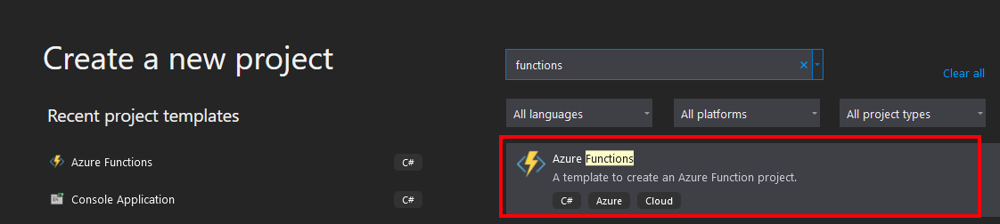

# Create Azure Function using Visual Studio
1. Start by Creating a new a *Function* project


2. You can leave the default configuration


3. Use empty template


4. Adding new functions


5. You can select all different kinds of triggers and set the appropriate settings associated with it. For example with the `Http Trigger` you may set the authorization level.


6. The generated function will have some sample code in it, that gets the `name` property off the query and prints out a message.
    ```
    public static class Function1
    {
        [FunctionName("Function1")]
        public static async Task<IActionResult> Run(
            [HttpTrigger(AuthorizationLevel.Function, "get", "post", Route = null)] HttpRequest req,
            ILogger log)
        {
            log.LogInformation("C# HTTP trigger function processed a request.");

            string name = req.Query["name"];

            string requestBody = await new StreamReader(req.Body).ReadToEndAsync();
            dynamic data = JsonConvert.DeserializeObject(requestBody);
            name = name ?? data?.name;

            string responseMessage = string.IsNullOrEmpty(name)
                ? "This HTTP triggered function executed successfully. Pass a name in the query string or in the request body for a personalized response."
                : $"Hello, {name}. This HTTP triggered function executed successfully.";

            return new OkObjectResult(responseMessage);
        }
    }
    ```
7. When running the function from Visual Studio, it will start a function console app that outputs the address on which all the functions are running on:


8. Making a call to that URL with a parameter `name` set should return a greetings message.


Sample solution is checked in [here](https://github.com/igormesaros84/Az204/tree/master/Az-204/Implement%20Azure%20Functions/Examples/Create%20Azure%20functions%20by%20Visual%20Studio/ServerlessFuncs)
