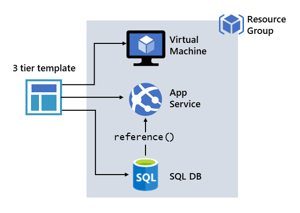
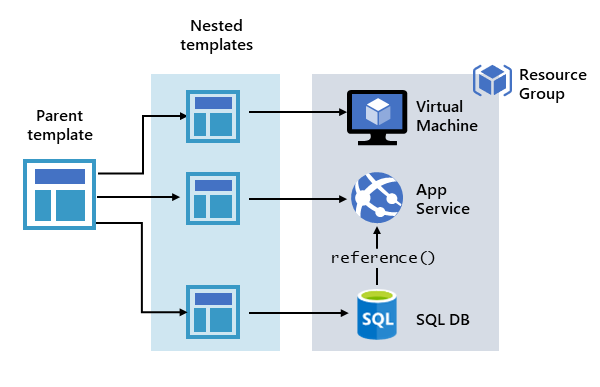

- [Azure Resource Manager Fundamentals](#azure-resource-manager-fundamentals)
- [Explore Azure Resource Manager](#explore-azure-resource-manager)
  - [Resource relationships](#resource-relationships)
- [Using ARM templates](#using-arm-templates)
  - [Where to get templates](#where-to-get-templates)
  - [Deploying an ARM template](#deploying-an-arm-template)
- [Deploy multi-tiered solutions](#deploy-multi-tiered-solutions)
  - [Defining multi-tiered templates](#defining-multi-tiered-templates)
  - [New or existing resource](#new-or-existing-resource)
- [Best Practices](#best-practices)

# Azure Resource Manager Fundamentals
ARM Supports massive parallel operations via declarative templates with granular RBAC. Resource providers provide resource types

View all locations
```
Get-AzLocation | Format-Table Location, DisplayName -AutoSize
```

List the resource providers that are registered
```
Get-AzResourceProvider -Location "uksouth"
```

Get all the resource providers
```
Get-AzResourceProvider -Location "uksouth" -ListAvailable
```

Same information can be seen in the Azure portal as well for a given subscription in the `Resource providers` blade.


If you wish to create a template for a certain resource the appropriate resource provider needs to be registered.

To look into what's actually in a resource provider
```
Get-AzResourceProvider -ProviderNamespace Microsoft.Compute
```
# Explore Azure Resource Manager
When a user sends a request from any of the Azure tools, APIs, or SDKs, Resource Manager receives the request. It authenticates and authorizes the request. Resource Manager sends the request to the Azure service, which takes the requested action. Because all requests are handled through the same API, you see consistent results and capabilities in all the different tools.

The following image shows the role Azure Resource Manager plays in handling Azure requests.


## Resource relationships
For example a VM depends on a disk which are both separate resources. When they are provisioned azure knows that it needs to create the disc first as the VM depends on it.


# Using ARM templates
The ARM template has 3 key elements
- **Parameters** - These are values that are provided when the template is being executed.
- **Variables** - In this section you can define logic to define some values. This is so that these sometimes complex variables can be defined here and then just simply reused in the *Resources*.
- **Resources** - These are the resource types that come from the *Resource providers*. 

> **Important!** The template should not have any instance specific values hard coded. The goal is to be able to deploy a template unchanged between environments.

## Where to get templates
1. When creating a resource you always get offered the option to Download the resource as a template.
2. Every resource has an `Export template` blade under the automation section.
3. You can search for deploy custom template and there create a template with the help of the Azure Portal

4. You can find a bunch of templates on [github](https://github.com/Azure/azure-quickstart-templates)
5. VS Code has **Azure Resource Manager Tool** extension that can be used to edit the template JSON

## Deploying an ARM template
```
New-AzResourceGroupDeployment -ResourceGroupName RG-IaCSample `
    -TemplateFile "<somefilePath>\template.json" `
    -TemplateParameterFile "<somefilePath>\template.parameters.json" `
```

You can override some of the parameters by extending the command above:
```
New-AzResourceGroupDeployment -ResourceGroupName RG-IaCSample `
    -TemplateFile "<somefilePath>\template.json" `
    -TemplateParameterFile "<somefilePath>\template.parameters.json" `
    -OverrideParameterName 'New_Value'
```

When specifying `-Mode Complete` will clear out everything in the resource group that is not specified in the template. Resources that exist in the target and the template will get updated by the template.\
By default this mode is `Incremental` that will update values that already exist in the template. Values that exist in the target will get updated.

# Deploy multi-tiered solutions
With Resource Manager, you can create a template (in JSON format) that defines the infrastructure and configuration of your Azure solution. By using a template, you can repeatedly deploy your solution throughout its lifecycle and have confidence your resources are deployed in a consistent state.

When you deploy a template, Resource Manager converts the template into REST API operations.
```
"resources": [
  {
    "type": "Microsoft.Storage/storageAccounts",
    "apiVersion": "2019-04-01",
    "name": "mystorageaccount",
    "location": "westus",
    "sku": {
      "name": "Standard_LRS"
    },
    "kind": "StorageV2",
    "properties": {}
  }
]
```
It converts the definition to the following REST API operation, which is sent to the `Microsoft.Storage` resource provider:
```
PUT
https://management.azure.com/subscriptions/{subscriptionId}/resourceGroups/{resourceGroupName}/providers/Microsoft.Storage/storageAccounts/mystorageaccount?api-version=2019-04-01
REQUEST BODY
{
  "location": "westus",
  "sku": {
    "name": "Standard_LRS"
  },
  "kind": "StorageV2",
  "properties": {}
}
```
Notice that the apiVersion you set in the template for the resource is used as the API version for the REST operation. You can repeatedly deploy the template and have confidence it will continue to work.

## Defining multi-tiered templates
How you define templates and resource groups is entirely up to you and how you want to manage your solution. For example, you can deploy a three tier application through a single template to a single resource group.


The following image shows how to deploy a three tier solution through a parent template that includes three nested templates.


## New or existing resource
You can use conditional deployment to create a new resource or use an existing one. The following example shows how to use condition to deploy a new storage account or use an existing storage account. It contains a parameter named `newOrExisting` which is used as a condition in the `resources` section.
```
{
  "$schema": "https://schema.management.azure.com/schemas/2019-04-01/deploymentTemplate.json#",
  "contentVersion": "1.0.0.0",
  "parameters": {
    "storageAccountName": {
      "type": "string"
    },
    "location": {
      "type": "string",
      "defaultValue": "[resourceGroup().location]"
    },
    "newOrExisting": {
      "type": "string",
      "defaultValue": "new",
      "allowedValues": [
        "new",
        "existing"
      ]
    }
  },
  "functions": [],
  "resources": [
    {
      "condition": "[equals(parameters('newOrExisting'), 'new')]",
      "type": "Microsoft.Storage/storageAccounts",
      "apiVersion": "2019-06-01",
      "name": "[parameters('storageAccountName')]",
      "location": "[parameters('location')]",
      "sku": {
        "name": "Standard_LRS",
        "tier": "Standard"
      },
      "kind": "StorageV2",
      "properties": {
        "accessTier": "Hot"
      }
    }
  ]
}
```

# Best Practices
- There are limits for a template, if the template is too big, use linked templates
- Use parameters only as required
- Use variables if the value is needed more than once or needs to be constructed by an expression
- Use "comments" for resources
- Don't use DependsOn unless required as will reduce parallelism
- Try and create a library of template components