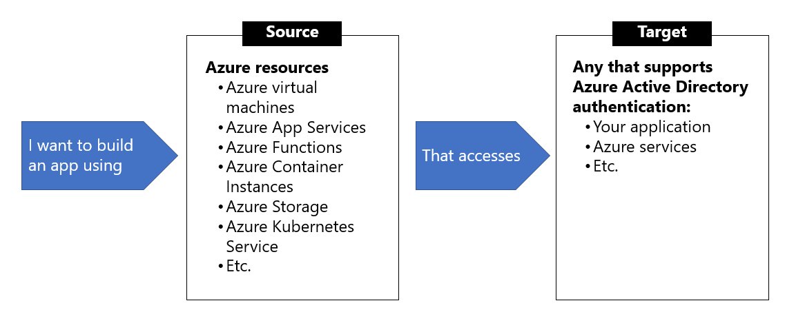

- [Explore managed identities](#explore-managed-identities)
  - [Types of managed identities](#types-of-managed-identities)
  - [Characteristics of managed identities](#characteristics-of-managed-identities)
  - [When to use managed identities](#when-to-use-managed-identities)
  - [What Azure services support managed identities?](#what-azure-services-support-managed-identities)
- [Discover the managed identities authentication flow](#discover-the-managed-identities-authentication-flow)
  - [How a system-assigned managed identity works with an Azure virtual machine](#how-a-system-assigned-managed-identity-works-with-an-azure-virtual-machine)
  - [How a user-assigned managed identity works with an Azure virtual machine](#how-a-user-assigned-managed-identity-works-with-an-azure-virtual-machine)
- [Configure managed identities](#configure-managed-identities)
  - [System-assigned managed identity](#system-assigned-managed-identity)
  - [Enable system-assigned managed identity during creation of an Azure virtual machine](#enable-system-assigned-managed-identity-during-creation-of-an-azure-virtual-machine)
  - [Enable system-assigned managed identity on an existing Azure virtual machine](#enable-system-assigned-managed-identity-on-an-existing-azure-virtual-machine)
  - [User-assigned managed identity](#user-assigned-managed-identity)
  - [Create a user-assigned identity](#create-a-user-assigned-identity)
  - [Assign a user-assigned managed identity during the creation of an Azure virtual machine](#assign-a-user-assigned-managed-identity-during-the-creation-of-an-azure-virtual-machine)
  - [Assign a user-assigned managed identity to an existing Azure virtual machine](#assign-a-user-assigned-managed-identity-to-an-existing-azure-virtual-machine)
- [Acquire an access token](#acquire-an-access-token)
  - [Acquire a token](#acquire-a-token)
  - [Get a token by using C](#get-a-token-by-using-c)

# Explore managed identities

Managed identities provide an identity for applications to use when connecting to resources that support Azure Active Directory (Azure AD) authentication. Applications may use the managed identity to obtain Azure AD tokens. 

## Types of managed identities 

There are two types of managed identities:
- A **system-assigned managed identity** is enabled directly on an Azure service instance. When the identity is enabled, Azure creates an identity for the instance in the Azure AD tenant that's trusted by the subscription of the instance.
- A **user-assigned managed identity** is created as a standalone Azure resource. Through a create process, Azure creates an identity in the Azure AD tenant that's trusted by the subscription in use. After the identity is created, the identity can be assigned to one or more Azure service instances.

Internally, managed identities are service principals of a special type, which are locked to only be used with Azure resources. When the managed identity is deleted, the corresponding service principal is automatically removed.

## Characteristics of managed identities
The table below highlights some of the key differences between the two types of managed identities.

| Characteristic | System-assigned managed identity | User-assigned managed identity |
|----------------|----------------------------------|-----------------|
Creation | Created as part of an Azure resource (for example, an Azure virtual machine or Azure App Service) | Created as a stand-alone Azure resource |
Lifecycle | Shared lifecycle with the Azure resource that the managed identity is created with. When the parent resource is deleted, the managed identity is deleted as well. | Independent life-cycle. Must be explicitly deleted.
Sharing across Azure resources | Cannot be shared, it can only be associated with a single Azure resource | Can be shared, the same user-assigned managed identity can be associated with more than one Azure resource

## When to use managed identities
The image below gives an overview the scenarios that support using managed identities.



## What Azure services support managed identities?
Managed identities for Azure resources can be used to authenticate to services that support Azure Active Directory authentication. 

# Discover the managed identities authentication flow
In this unit, you learn how managed identities work with Azure virtual machines. Below are the flows detailing how the two types of managed identities work with with an Azure virtual machine.

## How a system-assigned managed identity works with an Azure virtual machine

1. Azure Resource Manager receives a request to enable the system-assigned managed identity on a virtual machine.

2. Azure Resource Manager creates a service principal in Azure Active Directory for the identity of the virtual machine. The service principal is created in the Azure Active Directory tenant that's trusted by the subscription.

3. Azure Resource Manager configures the identity on the virtual machine by updating the Azure Instance Metadata Service identity endpoint with the service principal client ID and certificate.

4. After the virtual machine has an identity, use the service principal information to grant the virtual machine access to Azure resources. To call Azure Resource Manager, use role-based access control in Azure Active Directory to assign the appropriate role to the virtual machine service principal. To call Key Vault, grant your code access to the specific secret or key in Key Vault.

5. Your code that's running on the virtual machine can request a token from the Azure Instance Metadata service endpoint, accessible only from within the virtual machine: http://169.254.169.254/metadata/identity/oauth2/token

6. A call is made to Azure Active Directory to request an access token (as specified in step 5) by using the client ID and certificate configured in step 3. Azure Active Directory returns a JSON Web Token (JWT) access token.

7. Your code sends the access token on a call to a service that supports Azure Active Directory authentication.

## How a user-assigned managed identity works with an Azure virtual machine

1. Azure Resource Manager receives a request to create a user-assigned managed identity.

2. Azure Resource Manager creates a service principal in Azure Active Directory for the user-assigned managed identity. The service principal is created in the Azure Active Directory tenant that's trusted by the subscription.

3. Azure Resource Manager receives a request to configure the user-assigned managed identity on a virtual machine and updates the Azure Instance Metadata Service identity endpoint with the user-assigned managed identity service principal client ID and certificate.

4. After the user-assigned managed identity is created, use the service principal information to grant the identity access to Azure resources. To call Azure Resource Manager, use role-based access control in Azure Active Directory to assign the appropriate role to the service principal of the user-assigned identity. To call Key Vault, grant your code access to the specific secret or key in Key Vault.

> You can also do this step before step 3.

5. Your code that's running on the virtual machine can request a token from the Azure Instance Metadata Service identity endpoint, accessible only from within the virtual machine: http://169.254.169.254/metadata/identity/oauth2/token

6. A call is made to Azure Active Directory to request an access token (as specified in step 5) by using the client ID and certificate configured in step 3. Azure Active Directory returns a JSON Web Token (JWT) access token.

7. Your code sends the access token on a call to a service that supports Azure Active Directory authentication.

# Configure managed identities
## System-assigned managed identity
To create, or enable, an Azure virtual machine with the system-assigned managed identity your account needs the `Virtual Machine Contributor` role assignment.
## Enable system-assigned managed identity during creation of an Azure virtual machine
The following example creates a virtual machine named myVM with a system-assigned managed identity, as requested by the --assign-identity parameter. The --admin-username and --admin-password parameters specify the administrative user name and password account for virtual machine sign-in.

```
az vm create --resource-group myResourceGroup \ 
    --name myVM --image win2016datacenter \ 
    --generate-ssh-keys \ 
    --assign-identity \ 
    --admin-username azureuser \ 
    --admin-password myPassword12
```

## Enable system-assigned managed identity on an existing Azure virtual machine

Use az vm identity assign command enable the system-assigned identity to an existing virtual machine:
```
az vm identity assign -g myResourceGroup -n myVm
```

## User-assigned managed identity
To assign a user-assigned identity to a virtual machine during its creation, your account needs the `Virtual Machine Contributor` and `Managed Identity Operator` role assignments. 

## Create a user-assigned identity
```
az identity create -g myResourceGroup -n myUserAssignedIdentity
```

## Assign a user-assigned managed identity during the creation of an Azure virtual machine
The following example creates a virtual machine associated with the new user-assigned identity, as specified by the --assign-identity parameter.

```
az vm create \
--resource-group <RESOURCE GROUP> \
--name <VM NAME> \
--image UbuntuLTS \
--admin-username <USER NAME> \
--admin-password <PASSWORD> \
--assign-identity <USER ASSIGNED IDENTITY NAME>
```

## Assign a user-assigned managed identity to an existing Azure virtual machine
Assign the user-assigned identity to your virtual machine using `az vm identity assign`.

```
az vm identity assign \
    -g <RESOURCE GROUP> \
    -n <VM NAME> \
    --identities <USER ASSIGNED IDENTITY>
```

# Acquire an access token
A client application can request managed identities for Azure resources app-only access token for accessing a given resource. The token is based on the managed identities for Azure resources service principal.

> All sample code/script in this unit assumes the client is running on a virtual machine with managed identities for Azure resources.

## Acquire a token
The fundamental interface for acquiring an access token is based on REST, making it accessible to any client application running on the VM that can make HTTP REST calls. 

Sample request using the Azure Instance Metadata Service (IMDS) endpoint:
```
GET 'http://169.254.169.254/metadata/identity/oauth2/token?api-version=2018-02-01&resource=https://management.azure.com/' HTTP/1.1 Metadata: true
```

## Get a token by using C#
The code sample below builds the request to acquire a token, calls the endpoint, and then extracts the token from the response.

```
using System;
using System.Collections.Generic;
using System.IO;
using System.Net;
using System.Web.Script.Serialization; 

// Build request to acquire managed identities for Azure resources token
HttpWebRequest request = (HttpWebRequest)WebRequest.Create("http://169.254.169.254/metadata/identity/oauth2/token?api-version=2018-02-01&resource=https://management.azure.com/");
request.Headers["Metadata"] = "true";
request.Method = "GET";

try
{
    // Call /token endpoint
    HttpWebResponse response = (HttpWebResponse)request.GetResponse();

    // Pipe response Stream to a StreamReader, and extract access token
    StreamReader streamResponse = new StreamReader(response.GetResponseStream()); 
    string stringResponse = streamResponse.ReadToEnd();
    JavaScriptSerializer j = new JavaScriptSerializer();
    Dictionary<string, string> list = (Dictionary<string, string>) j.Deserialize(stringResponse, typeof(Dictionary<string, string>));
    string accessToken = list["access_token"];
}
catch (Exception e)
{
    string errorText = String.Format("{0} \n\n{1}", e.Message, e.InnerException != null ? e.InnerException.Message : "Acquire token failed");
}
```
