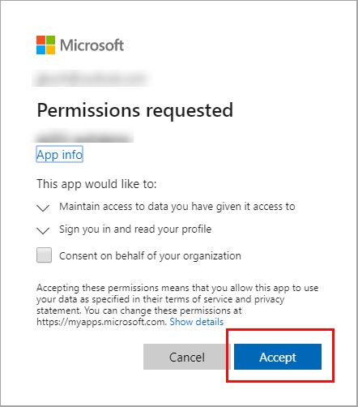

# Table of content
- [Table of content](#table-of-content)
- [Exercise: Implement interactive authentication by using MSAL.NET](#exercise-implement-interactive-authentication-by-using-msalnet)
  - [Register new application](#register-new-application)
  - [Set up the console application](#set-up-the-console-application)
  - [Build the console app](#build-the-console-app)
    - [Ad packages and using statements](#ad-packages-and-using-statements)
    - [Add code for the interactive authentication](#add-code-for-the-interactive-authentication)
    - [Acquire a token](#acquire-a-token)
    - [Run the application](#run-the-application)
# Exercise: Implement interactive authentication by using MSAL.NET
In this exercise you'll learn how to perform the following actions:

- Register an application with the Microsoft identity platform
- Use the PublicClientApplicationBuilder class in MSAL.NET
- Acquire a token interactively in a console application

## Register new application
1. Sign in to the portal: https://portal.azure.com
2. Search for and select **Azure Active Directory**.
3. Under **Manage**, select **App registrations > New registration**.
4. When the **Register an application** page appears, enter your application's registration information:

    |Field|Value|
    |-----|-----|
    Name |`az204appreg`
    Supported account types | Select Accounts in this organizational directory only
    Redirect URI (option) | Select Public client/native (mobile & desktop) and enter `http://localhost` in the box to the right.
    5. Select **Register**


Azure Active Directory assigns a unique application (client) ID to your app, and you're taken to your application's Overview page.

## Set up the console application
1. Launch Visual Studio Code and open a terminal by selecting Terminal and then New Terminal.
2. Create a folder for the project and change in to the folder.
3. Create the .Net console app
```
dotnet new console
```

## Build the console app
### Ad packages and using statements
1. Add the `Microsoft.Identity.Client` package to the project in a terminal in VS Code.
2. Open the Program.cs file and add `using` statements to include `Microsoft.Identity.Client` and to enable async operations.
```
using System.Threading.Tasks;
using Microsoft.Identity.Client;
```
3. Change the Main method to enable async.
```
public static async Task Main(string[] args)
```
### Add code for the interactive authentication
1. We'll need two variables to hold the Application (client) and Directory (tenant) IDs. You can copy those values from the portal. Add the code below and replace the string values with the appropriate values from the portal.
```
private const string _clientId = "APPLICATION_CLIENT_ID";
private const string _tenantId = "DIRECTORY_TENANT_ID";
```
2. Use the `PublicClientApplicationBuilder` class to build out the authorization context.
```
var app = PublicClientApplicationBuilder
    .Create(_clientId)
    .WithAuthority(AzureCloudInstance.AzurePublic, _tenantId)
    .WithRedirectUri("http://localhost")
    .Build();
```

|Code | Description |
|-----|-------------|
`.Create` | Creates a `PublicClientApplicationBuilder` from a clientID
`.WithAuthority` | Adds a know Authority corresponding to an ADFS server. In the code we're specifying the public cloud, and using the tenant for the app we registered

### Acquire a token
When you registered the az204appreg app it automatically generated an API permission user.read for Microsoft Graph. We'll use that permission to acquire a token.
1. Set the permission scope for the token request. Add the following code below the `PublicClientApplicationBuilder`.
```
string[] scopes = { "user.read" };
```
2. Add code to request the token and write the result out to the console.
```
AuthenticationResult result = await app.AcquireTokenInteractive(scopes).ExecuteAsync();

Console.WriteLine($"Token:\t{result.AccessToken}");
```

### Run the application
1. In the VS Code terminal run `dotnet build` to check for errors, then `dotnet run` to run the app.

2. The app will open the default browser prompting you to select the account you want to authenticate with. If there are multiple accounts listed select the one associated with the tenant used in the app.

3. If this is the first time you've authenticated to the registered app you will receive a Permissions requested notification asking you to approve the app to read data associated with your account. Select Accept.

4. You should see the results similar to the example below in the console.
```
Token:  eyJ0eXAiOiJKV1QiLCJub25jZSI6IlVhU.....
```
