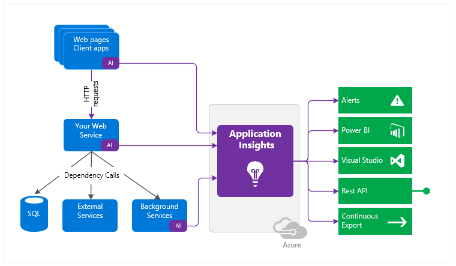
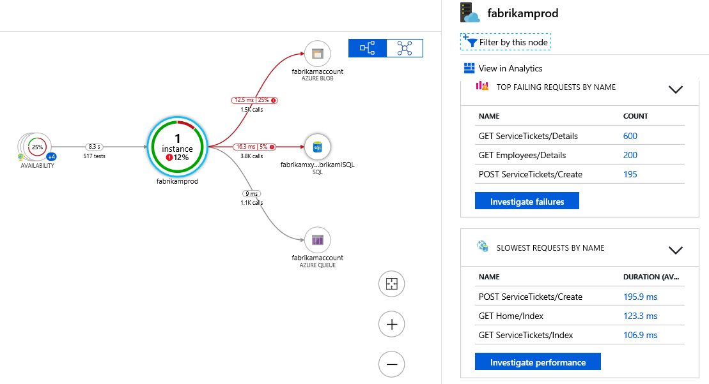

# Table of content
- [Table of content](#table-of-content)
- [Explore Azure Monitor](#explore-azure-monitor)
  - [What data does Azure Monitor collect?](#what-data-does-azure-monitor-collect)
  - [Insights and curated visualizations](#insights-and-curated-visualizations)
- [Explore Application Insights](#explore-application-insights)
  - [How Application Insights works](#how-application-insights-works)
  - [What Application Insights monitors](#what-application-insights-monitors)
  - [Use Application Insights](#use-application-insights)
- [Discover log-based metrics](#discover-log-based-metrics)
  - [Log-based metrics](#log-based-metrics)
  - [Pre-aggregated metrics](#pre-aggregated-metrics)
- [Instrument an app for monitoring](#instrument-an-app-for-monitoring)
  - [Auto-instrumentation](#auto-instrumentation)
  - [Instrumenting for distributed tracing](#instrumenting-for-distributed-tracing)
  - [How to enable distributed tracing](#how-to-enable-distributed-tracing)
  - [Enabling via Application Insights SDKs](#enabling-via-application-insights-sdks)
  - [Enable via OpenCensus](#enable-via-opencensus)
- [Select an availability test](#select-an-availability-test)
- [Troubleshoot app performance by using Application Map](#troubleshoot-app-performance-by-using-application-map)
# Explore Azure Monitor
The following diagram gives a high-level view of Azure Monitor. At the center of the diagram are the data stores for metrics and logs, which are the two fundamental types of data used by Azure Monitor. On the left are the sources of monitoring data that populate these data stores. On the right are the different functions that Azure Monitor performs with this collected data. This includes such actions as analysis, alerting, and streaming to external systems.

## What data does Azure Monitor collect?
- **Application monitoring data**: Performance and functionality of the code you have written, on any platform
- **Guest OS monitoring data**: Data about the operating system on which you application is running
- **Azure resource monitoring data**: Data about the operation of an Azure resource.
- ** Azure subscription monitoring data**: Data about the operation and management of an Azure subscription
- **Azure tenant monitoring data**: Data about the operation of tenant-level services, such as Azure AD

## Insights and curated visualizations
Azure resource providers have a "curated visualization" which gives you a customized monitoring experience for that particular service or set of services. They generally require minimal configuration. Larger scalable curated visualizations are known at "insights" and marked with that name in the documentation and Azure portal. Some examples are:
- **Application Insights**: Application Insights monitors the availability, performance, and usage of your web applications whether they're hosted in the cloud or on-premises. 
- **Container Insights**: Container Insights monitors the performance of container workloads that are deployed to managed Kubernetes clusters hosted on Azure Kubernetes Service (AKS) and Azure Container Instances.
- **VM Insights**: VM Insights monitors your Azure virtual machines (VM) at scale. 

# Explore Application Insights
Use it to monitor your live applications. It will automatically detect performance anomalies, and includes powerful analytics tools to help you diagnose issues and to understand what users actually do with your app. 

## How Application Insights works
You install a small instrumentation package (SDK) in your application or enable Application Insights using the Application Insights Agent when supported. 

In addition, you can pull in telemetry from the host environments such as performance counters, Azure diagnostics, or Docker logs. 

## What Application Insights monitors
It monitors:
- **Request rates, response times, and failure rates** - Find out which pages are most popular, at what times of day, and where your users are. See which pages perform best. If your response times and failure rates go high when there are more requests, then perhaps you have a resourcing problem.
- **Dependency rates, response times, and failure rates** - Find out whether external services are slowing you down.
- **Exceptions** - Analyze the aggregated statistics, or pick specific instances and drill into the stack trace and related requests. 
- **Page views and load performance** - reported by your users' browsers
- **AJAX calls from web pages**
- **User and session counts.**
- **Performance counters**
- **Host diagnostics**
- **Diagnostic trace logs from your app**
- **Custom events and metrics**

## Use Application Insights
Application Insights is one of the many services hosted within Microsoft Azure, and telemetry is sent there for analysis and presentation. It is free to sign up, and if you choose the basic pricing plan of Application Insights, there's no charge until your application has grown to have substantial usage.

There are several ways to get started monitoring and analyzing app performance:

- At run time: instrument your web app on the server. 
- At development time: add Application Insights to your code. 
- Instrument your web pages for page view, AJAX, and other client-side telemetry.
- Analyze mobile app usage by integrating with Visual Studio App Center.
- Availability tests - ping your website regularly from our servers.

# Discover log-based metrics
There are two kinds of metrics:

- **Log-based metrics** behind the scene are translated into Kusto queries from stored events.
- **Standard metrics** are stored as pre-aggregated time series.

Since standard metrics are pre-aggregated during collection, they have better performance at query time. This makes them a better choice for dashboarding and in real-time alerting. The log-based metrics have more dimensions, which makes them the superior option for data analysis and ad-hoc diagnostics. Use the namespace selector to switch between log-based and standard metrics in [metrics explorer.

## Log-based metrics
It can be emitted both manually with code or they can be done with auto-instrumentation.
For situations when the volume of events is too high, Application Insights implements several telemetry volume reduction techniques, such as sampling and filtering that reduce the number of collected and stored events. Unfortunately, lowering the number of stored events also lowers the accuracy of the metrics that, behind the scenes, must perform query-time aggregations of the events stored in logs.

## Pre-aggregated metrics
Both, log-based and pre-aggregated metrics coexist in Application Insights. To differentiate the two, in the Application Insights UX the pre-aggregated metrics are now called "Standard metrics (preview)", while the traditional metrics from the events were renamed to "Log-based metrics".

# Instrument an app for monitoring
## Auto-instrumentation
Auto-instrumentation allows you to enable application monitoring with Application Insights without changing your code.

## Instrumenting for distributed tracing
Distributed tracing is the equivalent of call stacks for modern cloud and microservices architectures, with the addition of a simplistic performance profiler thrown in. 

## How to enable distributed tracing
Enabling distributed tracing across the services in an application is as simple as adding the proper SDK or library to each service, based on the language the service was implemented in.

## Enabling via Application Insights SDKs
With the proper Application Insights SDK installed and configured, tracing information is automatically collected for popular frameworks, libraries, and technologies by SDK dependency auto-collectors.

Additionally, any technology can be tracked manually with a call to `TrackDependency` on the `TelemetryClient`.

## Enable via OpenCensus
In addition to the Application Insights SDKs, Application Insights also supports distributed tracing through OpenCensus. OpenCensus is an open source, vendor-agnostic, single distribution of libraries to provide metrics collection and distributed tracing for services. 

# Select an availability test
After you've deployed your web app or website, you can set up recurring tests to monitor availability and responsiveness.
Application Insights sends web requests to your application at regular intervals from points around the world. It can alert you if your application isn't responding or responds too slowly.

You can create up to 100 availability tests per Application Insights resource, and there are three types of availability tests:

- URL ping test (classic):  You can create this simple test through the portal to validate whether an endpoint is responding and measure performance associated with that response.
- Standard test (Preview): This single request test is similar to the URL ping test. It includes SSL certificate validity, proactive lifetime check, HTTP request verb (for example `GET`, `HEAD`, or `POST`), custom headers, and custom data associated with your HTTP request.
- Custom Track Availability test: If you decide to create a custom application to run availability tests, you can use the TrackAvailability() method to send the results to Application Insights.

# Troubleshoot app performance by using Application Map
Application Map helps you spot performance bottlenecks or failure hotspots across all components of your distributed application. 

Components are independently deployable parts of your distributed/microservices application. Developers and operations teams have code-level visibility or access to telemetry generated by these application components.

- Components are different from "observed" external dependencies such as SQL, Event Hubs, etc. which your team/organization may not have access to (code or telemetry).
- Components run on any number of server/role/container instances.
- Components can be separate Application Insights instrumentation keys (even if subscriptions are different) or different roles reporting to a single Application Insights instrumentation key. The preview map experience shows the components regardless of how they are set up.

This experience starts with progressive discovery of the components. When you first load the application map, a set of queries is triggered to discover the components related to this component.
The initial load for such an application will have all its components.

One of the key objectives with this experience is to be able to visualize complex topologies with hundreds of components. Click on any component to see related insights and go to the performance and failure triage experience for that component.

Application Map uses the cloud role name property to identify the components on the map. You can manually set or override the cloud role name and change what gets displayed on the Application Map.